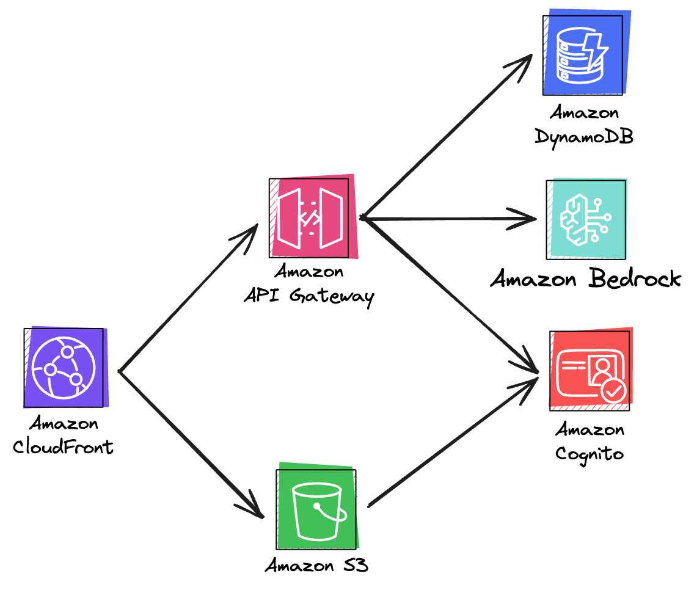

# Blazingly Fast AI Powered Serverless Note App with Blazor, Amazon Bedrock and Dotnet 10 Native AOT

I have [already explored](https://www.ganhammar.se/posts/dotnet-8-aot-aws-lambda) buildig native AOT Lambda functions for dotnet 8, before the official runtime was [announced](https://aws.amazon.com/blogs/compute/introducing-the-net-8-runtime-for-aws-lambda/), using [Amazon Linux 2023 custom Lambda runtime](https://docs.aws.amazon.com/linux/al2023/ug/lambda.html). With this post, I wanted to revisit that topic but focusing on dotnet 10 with the adition of a frontend, using [Blazor](https://dotnet.microsoft.com/en-us/apps/aspnet/web-apps/blazor) and the component library [MudBlazor](https://mudblazor.com/). On top off that, I wanted to utilize [Amazon Bedrock](https://aws.amazon.com/bedrock/?sc_channel=ps&gad_campaignid=21048268986&gbraid=0AAAAADjHtp-DIi_ig6Ui4a04qUGgFAJlz) and the [Nova Lite](https://docs.aws.amazon.com/nova/latest/userguide/what-is-nova.html) AI model. The result is a blazingly fast AI powered note app, where Bedrock will be used to categorize notes that the user creates.

One off the goals with this project is to utilize C# for the entire stack, therefore we will use [AWS Cloud Development Kit (CDK)](https://aws.amazon.com/cdk/) to define the infrastructure, in C#.

If you are curious about the benefits of building native AOT applications in dotnet, checkout the [previous](https://www.ganhammar.se/posts/dotnet-8-aot-aws-lambda) post.

# Implementation

## Solution Architecture

Except for AWS Lambda and Amazon Bedrock, this project will utilize Amazon CloudFront, to serve the Blazor application with Amazon S3 as the static origin, Amazon Cognito for auth, and Amazon Dynamodb, where we will store the notes.



## Solution Structure

The solution will be structured like this:

```sh
.
├── infra/
│   └── SmartNoteOrganizer.Infrastructure/
└── src/
    ├── SmartNoteOrganizer.AI/
    ├── SmartNoteOrganizer.Notes/
    ├── SmartNoteOrganizer.Shared/
    └── SmartNoteOrganizer.UI/
```

## Bootstrapping

We will use dotnet templates to kickstart the project, let's start with generating the solution and the projects:

```bash
dotnet new sln -n SmartNoteOrganizer

# Backend & Infrastructure
dotnet new classlib -n SmartNoteOrganizer.Infrastructure -f net10.0 -o infra/SmartNoteOrganizer.Infrastructure
dotnet new classlib -n SmartNoteOrganizer.Shared -f net10.0 -o src/SmartNoteOrganizer.Shared
dotnet new web -n SmartNoteOrganizer.Notes -f net10.0 -o src/SmartNoteOrganizer.Notes
dotnet new classlib -n SmartNoteOrganizer.AI -f net10.0 -o src/SmartNoteOrganizer.AI

# Frontend
dotnet new blazorwasm -n SmartNoteOrganizer.UI -f net10.0 -o src/SmartNoteOrganizer.UI
```

Now, let's add the required NuGet packages:

```bash
# CDK
dotnet add infra/SmartNoteOrganizer.Infrastructure/SmartNoteOrganizer.Infrastructure.csproj package Amazon.CDK.Lib
dotnet add infra/SmartNoteOrganizer.Infrastructure/SmartNoteOrganizer.Infrastructure.csproj package Constructs

# Lambda
dotnet add src/SmartNoteOrganizer.Notes/SmartNoteOrganizer.Notes.csproj package Amazon.Lambda.AspNetCoreServer.Hosting
dotnet add src/SmartNoteOrganizer.Notes/SmartNoteOrganizer.Notes.csproj package AWSSDK.DynamoDBv2
dotnet add src/SmartNoteOrganizer.Notes/SmartNoteOrganizer.Notes.csproj package AWSSDK.BedrockRuntime

# AI
dotnet add src/SmartNoteOrganizer.AI/SmartNoteOrganizer.AI.csproj package AWSSDK.BedrockRuntime

# UI
dotnet add src/SmartNoteOrganizer.UI/SmartNoteOrganizer.UI.csproj package MudBlazor

# References
dotnet add src/SmartNoteOrganizer.Notes/SmartNoteOrganizer.Notes.csproj reference src/SmartNoteOrganizer.AI/SmartNoteOrganizer.AI.csproj
dotnet add src/SmartNoteOrganizer.Notes/SmartNoteOrganizer.Notes.csproj reference src/SmartNoteOrganizer.Shared/SmartNoteOrganizer.Shared.csproj
dotnet add src/SmartNoteOrganizer.UI/SmartNoteOrganizer.UI.csproj reference src/SmartNoteOrganizer.Shared/SmartNoteOrganizer.Shared.csproj
```

## Shared Models

Great! Let's get started with the code, starting with the shared models. Create the file `src/SmartNoteOrganizer.Shared/Models.cs` and define the `Note` models:

```csharp
namespace SmartNoteOrganizer.Shared;

public record Note(string Id, string UserId, string Content, List<string> Tags, DateTime CreatedAt, DateTime UpdatedAt);
public record CreateNoteRequest(string Content);
public record NoteResponse(string Id, string Content, List<string> Tags, List<string> SuggestedTags, DateTime CreatedAt);
```

## Configure Lambda for Native AOT

In `src/SmartNoteOrganizer.Notes/SmartNoteOrganizer.Notes.csproj`, edit the first `PropertyGroup`:

```xml
<PropertyGroup>
  <TargetFramework>net10.0</TargetFramework>
  <PublishAot>true</PublishAot>
  <AssemblyName>bootstrap</AssemblyName>
  <RuntimeIdentifiers>linux-arm64</RuntimeIdentifiers>
  <JsonSerializerIsReflectionEnabledByDefault>false</JsonSerializerIsReflectionEnabledByDefault>
</PropertyGroup>
```

Now, let's create `LambdaJsonSerializerContext.cs` in the notes project:

```csharp
using System.Text.Json.Serialization;
using Amazon.Lambda.APIGatewayEvents;
using SmartNoteOrganizer.Shared;

namespace SmartNoteOrganizer.Notes;

// Lambda runtime types
[JsonSerializable(typeof(APIGatewayHttpApiV2ProxyRequest))]
[JsonSerializable(typeof(APIGatewayHttpApiV2ProxyResponse))]

// Endpoint types
[JsonSerializable(typeof(CreateNoteRequest))]
[JsonSerializable(typeof(NoteResponse))]
[JsonSerializable(typeof(List<Note>))]
public partial class LambdaJsonSerializerContext : JsonSerializerContext;
```

And update `Program.cs` to utilize the json serializer context:

```csharp
using Amazon.Lambda.Serialization.SystemTextJson;

builder.Services.AddAWSLambdaHosting(LambdaEventSource.HttpApi,
    new SourceGeneratorLambdaJsonSerializer<LambdaJsonSerializerContext>());
builder.Services.ConfigureHttpJsonOptions(options => {
    options.SerializerOptions.TypeInfoResolverChain.Insert(0, LambdaJsonSerializerContext.Default);
});
```

## Implement Bedrock AI Service

First, let's mark `SmartNoteOrganizer.AI.csproj` as AOT-compatible:

```xml
<IsAotCompatible>true</IsAotCompatible>
<JsonSerializerIsReflectionEnabledByDefault>false</JsonSerializerIsReflectionEnabledByDefault>
```

And create the JSON serializer context based on the Nova API, create `BedrockJsonSerializerContext.cs`:

```csharp
using System.Text.Json.Serialization;

namespace SmartNoteOrganizer.AI;

[JsonSerializable(typeof(NovaRequest))]
[JsonSerializable(typeof(NovaMessage))]
[JsonSerializable(typeof(NovaContent))]
[JsonSerializable(typeof(NovaInferenceConfig))]
[JsonSerializable(typeof(NovaResponse))]
[JsonSerializable(typeof(NovaOutput))]
[JsonSerializable(typeof(NovaResponseMessage))]
[JsonSerializable(typeof(List<string>))]
public partial class BedrockJsonSerializerContext : JsonSerializerContext;

public record NovaRequest(
    [property: JsonPropertyName("messages")] NovaMessage[] Messages,
    [property: JsonPropertyName("inferenceConfig")] NovaInferenceConfig InferenceConfig
);

public record NovaMessage(
    [property: JsonPropertyName("role")] string Role,
    [property: JsonPropertyName("content")] NovaContent[] Content
);

public record NovaContent(
    [property: JsonPropertyName("text")] string Text
);

public record NovaInferenceConfig(
    [property: JsonPropertyName("max_new_tokens")] int MaxTokens,
    [property: JsonPropertyName("temperature")] float Temperature,
    [property: JsonPropertyName("top_p")] float TopP
);

public record NovaResponse(
    [property: JsonPropertyName("output")] NovaOutput? Output
);

public record NovaOutput(
    [property: JsonPropertyName("message")] NovaResponseMessage? Message
);

public record NovaResponseMessage(
    [property: JsonPropertyName("content")] List<NovaContent>? Content
);
```

Now it's time to create the service which will utilize Bedrock to categorize notes for the user, create `BedrockService.cs`:

```csharp
using System.Text.Json;
using Amazon.BedrockRuntime;
using Amazon.BedrockRuntime.Model;

namespace SmartNoteOrganizer.AI;

public interface IBedrockService
{
    Task<List<string>> SuggestTagsAsync(string noteContent);
}

public class BedrockService(IAmazonBedrockRuntime bedrockClient) : IBedrockService
{
    private const string ModelId = "amazon.nova-lite-v1:0";

    public async Task<List<string>> SuggestTagsAsync(string noteContent)
    {
        var novaRequest = new NovaRequest(
            Messages: [
                new NovaMessage(
                    Role: "user",
                    Content: [
                        new NovaContent(
                            Text: $"""
                                Analyze this note and suggest 3-5 relevant tags that categorize it.
                                Return ONLY a JSON array of tag strings, nothing else.

                                Note: {noteContent}

                                Example response: ["work", "meeting", "important"]
                                """
                        )
                    ]
                )
            ],
            InferenceConfig: new NovaInferenceConfig(
                MaxTokens: 200,
                Temperature: 0.3f,
                TopP: 0.9f
            )
        );

        var request = new InvokeModelRequest
        {
            ModelId = ModelId,
            ContentType = "application/json",
            Body = new MemoryStream(JsonSerializer.SerializeToUtf8Bytes(
                novaRequest,
                BedrockJsonSerializerContext.Default.NovaRequest))
        };

        try
        {
            var response = await bedrockClient.InvokeModelAsync(request);
            using var reader = new StreamReader(response.Body);
            var responseText = await reader.ReadToEndAsync();

            if (string.IsNullOrWhiteSpace(responseText))
                return [];

            var result = JsonSerializer.Deserialize(
                responseText,
                BedrockJsonSerializerContext.Default.NovaResponse);

            var tagsJson = result?.Output?.Message?.Content?.FirstOrDefault()?.Text?.Trim() ?? "[]";

            // Strip markdown code blocks if present
            if (tagsJson.StartsWith("```"))
            {
                var lines = tagsJson.Split('\n');
                tagsJson = string.Join('\n', lines.Skip(1).Take(lines.Length - 2)).Trim();
            }

            return JsonSerializer.Deserialize(
                tagsJson,
                BedrockJsonSerializerContext.Default.ListString) ?? [];
        }
        catch
        {
            return [];
        }
    }
}
```

Here we are using `amazon.nova-lite-v1:0`, which is AWS's fastest model, excellent for simple tasks like this.

## Implement DynamoDB Repository

Let's move back to the notes project and create `NotesRepository.cs`. The repository will handle two tasks, creating and listing user notes.

```csharp
using Amazon.DynamoDBv2;
using Amazon.DynamoDBv2.DocumentModel;
using SmartNoteOrganizer.Shared;

public interface INotesRepository
{
    Task<Note> CreateNoteAsync(string userId, string content, List<string> tags);
    Task<List<Note>> GetUserNotesAsync(string userId);
}

public class NotesRepository(IAmazonDynamoDB dynamoDb, string tableName) : INotesRepository
{
    private readonly Table _table = new TableBuilder(dynamoDb, tableName)
        .AddHashKey("PK", DynamoDBEntryType.String)
        .AddRangeKey("SK", DynamoDBEntryType.String)
        .Build();

    public async Task<Note> CreateNoteAsync(string userId, string content, List<string> tags)
    {
        var now = DateTime.UtcNow;
        var note = new Note(Guid.NewGuid().ToString(), userId, content, tags, now, now);

        await _table.PutItemAsync(new Document
        {
            ["PK"] = $"USER#{userId}",
            ["SK"] = $"NOTE#{note.Id}",
            ["Id"] = note.Id,
            ["UserId"] = note.UserId,
            ["Content"] = note.Content,
            ["Tags"] = tags,
            ["CreatedAt"] = now.ToString("O"),
            ["UpdatedAt"] = now.ToString("O")
        });

        return note;
    }

    public async Task<List<Note>> GetUserNotesAsync(string userId) =>
        [.. (await _table.Query($"USER#{userId}", new QueryFilter()).GetRemainingAsync())
            .Select(doc => new Note(
                doc["Id"],
                doc["UserId"],
                doc["Content"],
                doc["Tags"].AsListOfString(),
                DateTime.Parse(doc["CreatedAt"]),
                DateTime.Parse(doc["UpdatedAt"])
            ))];
}
```

Now, let's update our dependency injection to add the required services, in `src/SmartNotesOrganizer.Notes/Program.cs`, add:

```csharp
builder.Services.AddSingleton<IAmazonDynamoDB, AmazonDynamoDBClient>();
builder.Services.AddSingleton<IAmazonBedrockRuntime, AmazonBedrockRuntimeClient>();
builder.Services.AddSingleton<INotesRepository>(sp =>
    new NotesRepository(sp.GetRequiredService<IAmazonDynamoDB>(),
        Environment.GetEnvironmentVariable("TABLE_NAME") ?? "SmartNotes"));
builder.Services.AddSingleton<IBedrockService, BedrockService>();
```

## Map Our API Endpoints

We will need two API endpoints for this project, GET (to list) and POST (to create) notes. In `Program.cs`, add:

```csharp
app.MapGet("/notes", async (INotesRepository repo, HttpContext context) =>
    Results.Ok(await repo.GetUserNotesAsync(context.User.FindFirst("sub")!.Value)));

app.MapPost("/notes", async (CreateNoteRequest request, INotesRepository repo,
    IBedrockService bedrock, HttpContext context) =>
{
    var userId = context.User.FindFirst("sub")!.Value;
    var tags = await bedrock.SuggestTagsAsync(request.Content);
    var note = await repo.CreateNoteAsync(userId, request.Content, tags);

    return Results.Created($"/notes/{note.Id}",
        new NoteResponse(note.Id, note.Content, note.Tags, tags, note.CreatedAt));
});
```

## Configure Blazor WebAssembly for AOT

Before we jump into the UI project, make sure that you have the `wasm-tools` workload installed:

```bash
dotnet workload install wasm-tools
```

Now, update `src/SmartNoteOrganizer.UI/SmartNoteOrganizer.UI.csproj` to enable WebAssembly AOT:

```xml
<Project Sdk="Microsoft.NET.Sdk.BlazorWebAssembly">
  <PropertyGroup>
    <TargetFramework>net10.0</TargetFramework>
    <Nullable>enable</Nullable>
    <ImplicitUsings>enable</ImplicitUsings>
    <RunAOTCompilation>true</RunAOTCompilation>
  </PropertyGroup>
</Project>
```

## Implement Blazor UI with MudBlazor