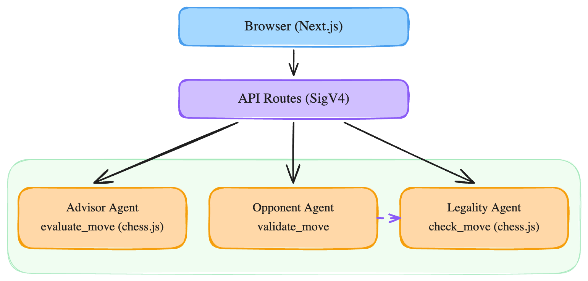
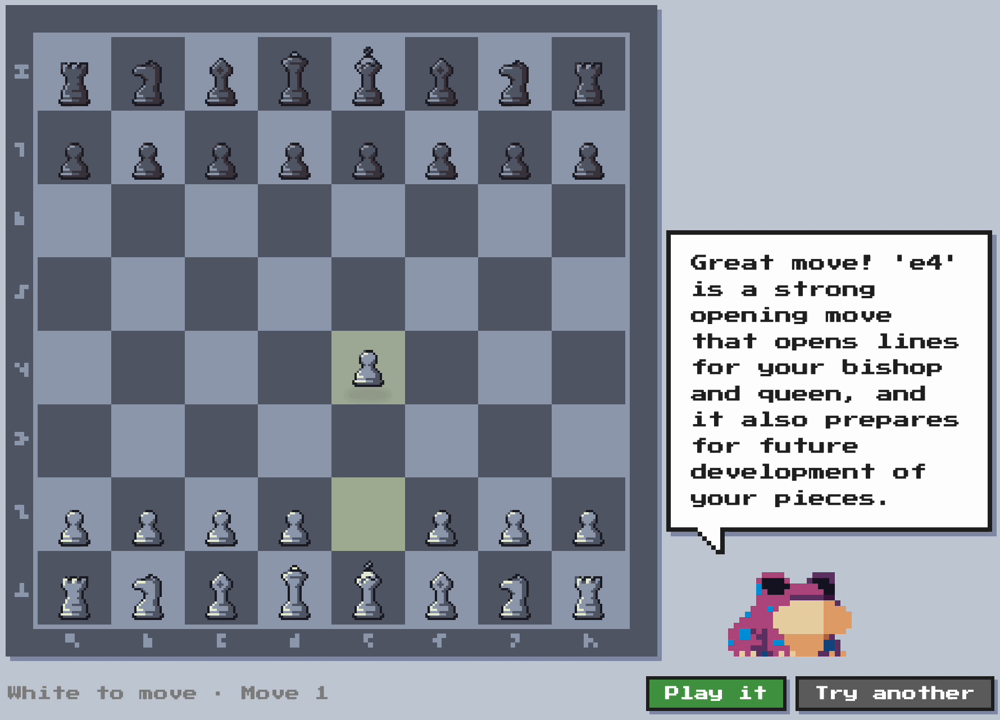

# Building a Centaur Chess App with AgentCore Runtime and Strands Agents

In 1998, Garry Kasparov proposed a new format: human players paired with computer assistance. He called it "Advanced Chess," though the community settled on a better name: centaur chess. The idea was simple. Neither human intuition nor raw computation would beat the combination of both.

Nearly three decades later, we have a new version of this pairing. Not human plus chess engine, but human plus language model. The engine calculated perfectly but couldn't explain itself. The LLM can reason about positions but can't search move trees. That contrast gives us something concrete to build with AWS's new agent infrastructure.

We'll use two pieces of that infrastructure. [AgentCore Runtime](https://docs.aws.amazon.com/bedrock/latest/userguide/agentcore.html) is a managed container runtime for AI agents, part of Amazon Bedrock. We give it a Docker image, it handles scaling, networking, and session routing.

[Strands Agents](https://github.com/strands-agents/sdk-typescript) is an open-source TypeScript SDK for building agents with tool use. It supports Amazon Bedrock and OpenAI out of the box, and we can add other providers. We define tools as functions with Zod schemas, wire them to a model, and the SDK manages the reasoning loop. It also supports MCP integration and response streaming, though we only use the tool pattern in this project.

## What We Are Building

A chess game where a human plays White, assisted by an AI advisor, against an AI opponent playing Black. Three agents, three different designs, one runtime platform.

Here's the architecture:



The Next.js API routes call AgentCore Runtime directly using the AWS SDK, which handles authentication automatically via the local credential chain.

The turn flow:

1. Player drags a piece on the board, and it appears "ghosted" at the destination
2. The legality agent validates the move asynchronously
3. If illegal, the piece flashes red and reverts. If legal, the advisor evaluates it
4. The advisor responds with a verdict, optionally suggesting an alternative
5. Player confirms their move, plays the alternative, or tries something else
6. The opponent picks a move, validates it by calling the legality agent directly (agent-to-agent), and responds with the validated move and resulting position
7. Repeat



## AgentCore Runtime

The container contract is minimal: implement `/ping` for health checks and `/invocations` for requests.

Here's why this matters compared to Lambda or Fargate. Lambda forces you into request-response with cold starts. Fargate gives you long-running containers but you manage the ALB, target groups, and scaling policies yourself. AgentCore Runtime provisions isolated microVMs per session, each with its own CPU, memory, and filesystem. Sessions can persist for up to 8 hours and survive multiple requests, but the infrastructure is fully managed. Deployment is a single resource definition.

Our server implementation is exactly the contract and nothing more:

```typescript
import express from 'express';
import { advisorAgent } from './advisor.js';
import { opponentAgent } from './opponent.js';
import { legalityAgent } from './legality.js';

const app = express();
app.use(express.raw({ type: '*/*', limit: '10mb' }));

const agent = process.env.AGENT_TYPE === 'opponent'
  ? opponentAgent
  : process.env.AGENT_TYPE === 'legality'
    ? legalityAgent
    : advisorAgent;

// Serialize invocations: Strands SDK agents reject concurrent invoke() calls.
let queue: Promise<void> = Promise.resolve();

app.get('/ping', (_req, res) => {
  res.json({ status: 'Healthy' });
});

app.post('/invocations', (req, res) => {
  queue = queue.then(async () => {
    const raw = Buffer.isBuffer(req.body) ? req.body.toString('utf-8') : String(req.body);
    const body = JSON.parse(raw || '{}');
    const prompt = body.prompt ?? raw;
    const result = await agent.invoke(prompt);
    res.json({ output: { message: result.toString() } });
  }).catch((err) => {
    console.error('Agent invocation failed:', err);
    res.status(500).json({ error: 'Agent invocation failed' });
  });
});

app.listen(8080, () => {
  console.log(`${process.env.AGENT_TYPE || 'advisor'} agent listening on 8080`);
});
```

Two things to note here. AgentCore forwards the payload without setting a `Content-Type` header, so we use `express.raw()` and parse manually. And the Strands SDK agent holds an internal lock during `invoke()`, rejecting concurrent calls. Since AgentCore may route multiple requests to the same container, we serialize invocations through a simple promise queue.

One Dockerfile, one image. The `AGENT_TYPE` environment variable selects which agent to run. We push the same image to three ECR repositories and set the variable at the AgentCore Runtime level.

## The Advisor Agent

The advisor is where things get interesting. We use the Strands Agents SDK to define an agent with a tool, a function the model can call during its reasoning loop.

A quick note on chess notation, since it shows up throughout the code. FEN (Forsyth-Edwards Notation) encodes an entire board position as a single string. SAN (Standard Algebraic Notation) describes a move like `Nf3` (knight to f3). LAN (Long Algebraic Notation) spells out both squares, like `g1f3`.

The tool checks whether a proposed move is legal and returns context about it:

```typescript
import { Agent, BedrockModel, tool } from '@strands-agents/sdk';
import { Chess } from 'chess.js';
import { z } from 'zod';

const evaluateMove = tool({
  name: 'evaluate_move',
  description: 'Check if a chess move is legal and get basic context',
  inputSchema: z.object({
    fen: z.string().describe('Current board position in FEN'),
    move: z.string().describe('Proposed move in SAN or LAN'),
  }),
  callback: ({ fen, move }) => {
    const chess = new Chess(fen);
    const result = chess.move(move);
    if (!result) return JSON.stringify({ legal: false });
    return JSON.stringify({
      legal: true,
      san: result.san,
      givesCheck: chess.isCheck(),
      captured: result.captured || null,
    });
  },
});
```

We use `chess.js` for move validation. The Zod schema tells the model what parameters it can pass. This is the pattern for most agent tools: give the model access to something it can't do on its own, and let it incorporate the result into its response.

The agent ties the tool to a model and a system prompt. We want the advisor to suggest better moves when it spots them, so the prompt asks it to prefix every response with a `SUGGESTED_MOVE:` line:

```typescript
export const advisorAgent = new Agent({
  model: new BedrockModel({ modelId: 'eu.amazon.nova-pro-v1:0' }),
  systemPrompt: `You are a chess coach advising a human player.
Use the evaluate_move tool to check the proposed move.

ALWAYS start your response with this exact line:
SUGGESTED_MOVE: <move or NONE>

Then write 1-2 sentences of advice.

Rules:
- If the move is good, write SUGGESTED_MOVE: NONE, then praise briefly.
- If the move is suboptimal or risky, use evaluate_move to find a better legal move,
  then write SUGGESTED_MOVE: <that move in SAN> (e.g. SUGGESTED_MOVE: Nf3).
  Then explain why it is better.
- The SUGGESTED_MOVE line must always be the very first line.
- Keep advice brief and conversational. Never lecture.`,
  tools: [evaluateMove],
  printer: false,
});
```

The API route strips the prefix line, extracts the move, and derives the verdict from whether an alternative exists.

On the frontend, the alternative drives the board UI directly. The player's proposed move appears ghosted on the board (semi-transparent highlighted squares), and they can confirm it, play the alternative, or try something else entirely.

## The Opponent Agent

The opponent demonstrates agent-to-agent communication. Rather than having the frontend orchestrate a separate legality call after each opponent move, the opponent validates its own moves by calling the legality agent directly through AgentCore Runtime.

The key piece is a `validate_move` tool that invokes the legality runtime:

```typescript
import {
  BedrockAgentCoreClient,
  InvokeAgentRuntimeCommand,
} from '@aws-sdk/client-bedrock-agentcore';

const agentCoreClient = new BedrockAgentCoreClient({
  region: process.env.AWS_REGION,
});

const validateMove = tool({
  name: 'validate_move',
  description:
    'Validate a chess move by calling the legality agent. ' +
    'Returns JSON with legal (boolean), san, newFen, isCheck, isCheckmate, isDraw.',
  inputSchema: z.object({
    fen: z.string().describe('Current board position in FEN'),
    move: z.string().describe('Proposed move in SAN notation'),
  }),
  callback: async ({ fen, move }) => {
    const command = new InvokeAgentRuntimeCommand({
      agentRuntimeArn: process.env.LEGALITY_ARN,
      runtimeSessionId: `opponent-legality-${Date.now()}`,
      payload: new TextEncoder().encode(
        JSON.stringify({
          prompt: `Position (FEN): ${fen}\nMove (SAN): ${move}\nValidate this move.`,
        }),
      ),
    });

    const response = await agentCoreClient.send(command);
    const text = await response.response?.transformToString();
    // ... parse and return the legality result
  },
});
```

This is a tool that calls another agent. The opponent's container has the legality agent's ARN as an environment variable, and we grant `bedrock-agentcore:InvokeAgentRuntime` permission through the IAM role. From the SDK's perspective, it is just another async tool callback. The model calls it, gets the result, and incorporates it into its reasoning.

The system prompt instructs the opponent to always validate before responding, and to retry if a move is illegal:

```typescript
export const opponentAgent = new Agent({
  model: new BedrockModel({ modelId: 'eu.amazon.nova-pro-v1:0' }),
  systemPrompt: `You are a chess engine playing Black.

PROCEDURE:
1. Choose a move in standard algebraic notation.
2. ALWAYS call validate_move with the FEN and your chosen move.
3. If the move is illegal, choose a different move and validate again.
4. Repeat until you find a legal move.

Once validated, respond with exactly three lines:
MOVE: <san>
FEN: <newFen from the validation result>
STATUS: <check|checkmate|draw|normal>`,
  tools: [validateMove],
  printer: false,
});
```

Compare this with the advisor. The advisor has a local tool (chess.js) that validates moves within the same process. The opponent has a remote tool that calls another agent over the network. The SDK handles both cases identically. We define the tool, the model decides when to call it, and the framework manages the loop. The only difference is that the remote tool is async and adds network latency.

This pattern, one agent calling another through AgentCore, is how we compose agents in this infrastructure. Each agent has a single responsibility, and composition happens through tool calls rather than orchestration code.

## The Legality Agent

The third agent handles move validation. The frontend has no chess library. Every move, whether from the player or the opponent, goes through this agent before it touches the board state.

```typescript
const checkMove = tool({
  name: 'check_move',
  description: 'Check if a chess move is legal given a FEN position using from/to squares',
  inputSchema: z.object({
    fen: z.string(),
    from: z.string(),
    to: z.string(),
    promotion: z.string().optional(),
  }),
  callback: ({ fen, from, to, promotion }) => {
    const chess = new Chess(fen);
    try {
      const result = chess.move({ from, to, promotion });
      if (!result) return JSON.stringify({ legal: false });
      return JSON.stringify({
        legal: true, san: result.san,
        isCheck: chess.isCheck(),
        isCheckmate: chess.isCheckmate(),
        isDraw: chess.isDraw(),
        captured: result.captured || null,
        newFen: chess.fen(),
      });
    } catch { return JSON.stringify({ legal: false }); }
  },
});

const checkSanMove = tool({
  name: 'check_san_move',
  description: 'Check if a chess move in SAN notation (e.g. Nf3, Bc4, e4) is legal',
  inputSchema: z.object({
    fen: z.string(),
    san: z.string(),
  }),
  callback: ({ fen, san }) => {
    const chess = new Chess(fen);
    try {
      const result = chess.move(san);
      if (!result) return JSON.stringify({ legal: false });
      return JSON.stringify({
        legal: true, san: result.san,
        isCheck: chess.isCheck(),
        isCheckmate: chess.isCheckmate(),
        isDraw: chess.isDraw(),
        captured: result.captured || null,
        newFen: chess.fen(),
      });
    } catch { return JSON.stringify({ legal: false }); }
  },
});

export const legalityAgent = new Agent({
  model: new BedrockModel({ modelId: 'eu.amazon.nova-pro-v1:0' }),
  systemPrompt:
    'You validate chess moves. Call check_move (for from/to squares) or ' +
    'check_san_move (for SAN like Nf3, Bc4). ' +
    'Your ENTIRE response must be the JSON object returned by the tool. ' +
    'Do NOT add any text, explanation, or formatting. Only the raw JSON.',
  tools: [checkMove, checkSanMove],
  printer: false,
});
```

Wrapping chess.js in an LLM agent is inherently roundabout. A direct function call would be faster, cheaper, and more reliable. We chose this design deliberately as a teaching example. It demonstrates how the Strands SDK handles tool-equipped agents, how the model selects the right tool from multiple options, and (via the opponent's validate_move tool) how agents compose through AgentCore Runtime. Think of the legality agent as a stand-in for any validation service you might wrap in an agent interface.

We initially used Nova Micro for this agent, since legality checking is a tool-only operation. The model just needs to call the right tool and return its output. In practice, Nova Micro would call the tool correctly but then rewrite the JSON result as prose, ignoring the system prompt instruction to return raw JSON. Switching to Nova Pro solved this. The Python SDK has a [structured output feature](https://strandsagents.com/latest/documentation/docs/user-guide/concepts/agents/structured-output/) that validates responses against a schema and retries on failure, which could help here, but it's not yet available in the TypeScript SDK.

The agent has two tools because the frontend sends player moves as from/to squares (from the drag-and-drop interaction), while the opponent and advisor produce moves in SAN notation. Rather than converting between formats on the client, we let the model pick the appropriate tool.

The `newFen` field in the response is the key design choice. It gives the frontend the authoritative next position (with updated castling rights, en passant squares, and move clocks) without needing a chess library on the client. The frontend stores the board as a simple piece map (`Record<string, string>`, e.g. `{ e1: 'wK', d2: 'wP', ... }`) and reconstructs it from the FEN after each validated move.

This creates a UX tradeoff. With a client-side chess library, move validation is instant. With an async legality agent, there is a visible delay. We lean into it: the piece appears ghosted at its destination immediately, and a brief "checking move" state gives visual feedback. If the move turns out to be illegal, the destination square flashes red and the piece reverts. This feels responsive even though the validation is happening over the network.

## Deploying to AgentCore

The CDK stack creates six resources: three ECR repositories, an IAM role, and three AgentCore Runtimes. The IAM role trusts the AgentCore service principal and grants Bedrock model invocation:

```typescript
const runtimeRole = new iam.Role(this, 'AgentRuntimeRole', {
  assumedBy: new iam.ServicePrincipal('bedrock-agentcore.amazonaws.com'),
  inlinePolicies: {
    BedrockInvoke: new iam.PolicyDocument({
      statements: [
        new iam.PolicyStatement({
          actions: ['bedrock:InvokeModel', 'bedrock:InvokeModelWithResponseStream'],
          resources: ['*'],
        }),
      ],
    }),
  },
});
```

The runtimes themselves use the L2 construct from `@aws-cdk/aws-bedrock-agentcore-alpha`:

```typescript
const advisorRuntime = new agentcore.Runtime(this, 'AdvisorRuntime', {
  runtimeName: 'centaur-advisor',
  agentRuntimeArtifact: agentcore.AgentRuntimeArtifact.fromEcrRepository(advisorRepo, 'latest'),
  networkConfiguration: agentcore.RuntimeNetworkConfiguration.usingPublicNetwork(),
  environmentVariables: { AGENT_TYPE: 'advisor' },
  executionRole: runtimeRole,
});
```

That's the entire deployment for one agent. AgentCore Runtime handles the container lifecycle. The opponent and legality runtimes are identical except for the name and environment variable.

## Calling Agents from Next.js

The frontend calls AgentCore through Next.js API routes:

```typescript
import {
  BedrockAgentCoreClient,
  InvokeAgentRuntimeCommand,
} from '@aws-sdk/client-bedrock-agentcore';
import { pieceMapToFen, type GameMeta } from '../chess-utils';

const client = new BedrockAgentCoreClient({ region: process.env.AWS_REGION });

export async function POST(req: Request) {
  const { pieces, meta, move, sessionId } = await req.json();
  const fen = pieceMapToFen(pieces, meta);

  const command = new InvokeAgentRuntimeCommand({
    agentRuntimeArn: process.env.ADVISOR_ARN,
    runtimeSessionId: sessionId,
    payload: new TextEncoder().encode(
      JSON.stringify({
        prompt: `Position (FEN): ${fen}\nProposed move: ${move}\nEvaluate this move.`,
      }),
    ),
  });

  // ... response parsing unchanged
}
```

The API routes accept a piece map and game metadata from the frontend. A shared `pieceMapToFen` utility converts this to FEN for the agent prompt, keeping the frontend free of any chess library dependency.

The `runtimeSessionId` is worth noting. We generate one per game and pass it with every request. AgentCore uses this to route requests to the same microVM and maintain conversation context. This gives us session memory without writing any memory management code.

Sessions can persist for up to 8 hours with a configurable idle timeout (default 15 minutes). If a session terminates, the microVM is cleaned up and a new request with the same ID creates a fresh environment. For a chess game that typically lasts minutes, this is plenty.

> [!NOTE]
> Billing follows the session, not the request. The microVM stays alive
> until the idle timeout expires, so a game with long pauses pays for
> more idle time than compute.

## Tradeoffs

We learned a lot building this, but let's be direct about the limitations.

**LLM chess quality is poor.** Language models learn chess patterns from training data but don't search move trees. The opponent now self-validates through the legality agent, which eliminates illegal moves, but it chains two LLM calls for every validation (opponent tool call to legality agent, which itself calls a tool via the LLM). The positional judgment still isn't trustworthy. This is a teaching example, not a competitive chess application.

**Async validation is a deliberate tradeoff.** Removing the client-side chess library means every move goes through the network for validation. This adds latency compared to instant client-side checks. We traded that speed for a cleaner architecture (no chess logic duplicated between client and server) and a more interesting UX challenge. The ghost-move pattern, where the piece appears immediately and validates asynchronously, keeps the interaction feeling responsive. Whether this tradeoff makes sense depends on your latency budget. For a teaching example, it works well.

**The SDK is in preview.** The Strands Agents TypeScript SDK was released in late 2025. The API surface is clean and the tool pattern is well-designed, but breaking changes should be expected. The AgentCore CDK constructs are similarly early. The L2 construct library is alpha, and we found the documentation is still catching up with the implementation.

**Cost is worth mentioning.** Each agent session runs in a dedicated microVM that stays alive until the idle timeout (default 15 minutes). For a chess game with pauses between moves, that means we're paying for idle time within each session. For a teaching example this is fine, but for production we'd want to understand the pricing model and compare it against Lambda (pay-per-invocation) or Fargate (pay-per-task). AgentCore is still in preview, so pricing details may evolve.

**What's promising.** Going from "agent code in a Docker image" to "running in the cloud with session management" takes one CDK construct. The container contract (`/ping` + `/invocations`) is simple, and the Strands tool pattern (Zod schema in, typed callback out, model decides when to call) keeps tool definitions clean. The three agents in this project show the range: a tool-equipped advisor, a self-validating opponent that composes with another agent, and a pure validation agent. Same SDK, same deployment pattern, different designs for different jobs.

## Companion Repository

The full example is available in the [GitHub repository](https://github.com/ganhammar/centaur-chess). To deploy:

1. Clone the repo and run `npm install`
2. Configure AWS credentials for a region that supports AgentCore Runtime (at the time of writing, availability is limited, check the [AWS documentation](https://docs.aws.amazon.com/bedrock/latest/userguide/agentcore-supported-regions.html) for supported regions)
3. Run `./deploy.sh` to build, push images, and deploy infrastructure
4. Copy the output ARNs to `frontend/.env.local` (see `.env.local.example` for the format)
5. Run `npm run dev -w frontend` to start the local dev server

The board renders at `localhost:3000`. Drag a white piece to get the advisor's take, then confirm or try a different move.
