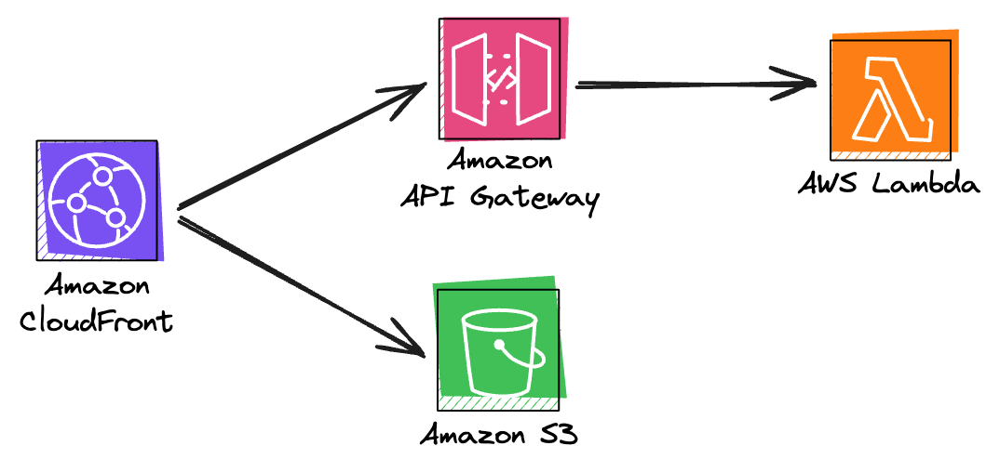

# OpenIddict on AWS Serverless: Adding Interactive Login

In a [previous post](https://www.ganhammar.se/posts/openiddict-on-aws-serverless-flexible-oauth2-oidc-provider), I described how OpenIddict, a flexible OAuth2/OIDC provider, can be deployed on AWS using only Serverless components such as AWS Lambda, API Gateway, DynamoDB, and Systems Manager Parameter Store. In this post, I'll demonstrate how to extend this demo project with interactive login using Amazon S3 and Amazon CloudFront. If you haven't checked out the first post and created the baseline for this project, I recommend starting there!

# Implementation

Let's jump straight into the implementation! Firstly, we will update the [openiddict-serverless-demo](https://github.com/ganhammar/openiddict-serverless-demo/tree/post-1) project to support interactive login, focusing on the [Authorization Code Flow](https://auth0.com/docs/get-started/authentication-and-authorization-flow/authorization-code-flow). Then we will create a new frontend project, which will use Vite, React, and Radix UI, and will proxy unmatched requests to the OpenIddict API. Finally, we'll add a CloudFront instance with two origins: S3 for the frontend project and API Gateway for the backend project.



## Adding Interactive Login

OpenIddict handles the authentication protocols and token issuance; it does not manage user accounts. Therefore, we must add a framework that can manage user accounts, such as [ASP.NET Core Identity](https://learn.microsoft.com/en-us/aspnet/core/security/authentication/identity). Since we're running on AWS Serverless, we'll use the DynamoDB provider [AspNetCore.Identity.AmazonDynamoDB](https://github.com/ganhammar/AspNetCore.Identity.AmazonDynamoDB). From the root of the `openiddict-serverless-demo` project, add the package with the following command:

```sh
> dotnet add package AspNetCore.Identity.AmazonDynamoDB --project src/OpenIddictServerlessDemo
```

Now we must configure the framework. In `Program.cs`, add the following code before the point where we configure OpenIddict (`AddOpenIddict`):

```csharp
services
    .AddIdentity<DynamoDbUser, DynamoDbRole>()
    .AddDefaultTokenProviders()
    .AddDynamoDbStores()
    .SetDefaultTableName("openiddict-serverless-demo.identity");
```

Next, in the block where we configure the OpenIddict server, we currently allow the Client Credentials flow. Add the following code to configure the authorize endpoint and to allow the Authorization Code flow:

```csharp
builder.SetAuthorizationEndpointUris("/connect/authorize");
builder.AllowAuthorizationCodeFlow();
```

Great, let's move on to the endpoints that we'll need to add for login to work. We're going to need two of them, one endpoint to check if the current user is already logged in and one endpoint to handle the actual login:

```csharp
app.MapPost("/api/user/login", [Consumes("application/json")] async (
  LoginInput? login,
  HttpContext httpContext,
  UserManager<DynamoDbUser> userManager,
  SignInManager<DynamoDbUser> signInManager) =>
{
  if (string.IsNullOrEmpty(login?.Email) || string.IsNullOrEmpty(login?.Password))
  {
    return Results.BadRequest();
  }

  var user = await userManager.FindByEmailAsync(login.Email);
  if (user == default)
  {
    return Results.BadRequest();
  }

  return Results.Ok(new LoginResult(
    await signInManager.PasswordSignInAsync(
      user.UserName!, login.Password, false, false)));
});

app.MapGet("/api/user/current", async(
  HttpContext httpContext,
  UserManager<DynamoDbUser> userManager
) =>
{
  if (httpContext!.User?.Identity?.IsAuthenticated != true)
  {
    return Results.NotFound();
  }

  var user = await userManager.GetUserAsync(httpContext!.User);
  return Results.Ok(user);
});
```
All endpoints are routed through `/api/` to simplify the CloudFront configuration. Otherwise, we would need one cache behavior per resource (`user` and `connect` today). This means we will also change the path for `/connect/token` to `/api/connect/token`.

The login endpoint depends on two models: one for the input and one for the output. Let's add them by creating two new files in a new `Models` folder. Start with `LoginInput.cs`, which only needs two properties, `Email` and `Password`:

```csharp
namespace OpenIddictServerlessDemo.Models;

public class LoginInput
{
    public string? Email { get; set; }
    public string? Password { get; set; }
}
```

Next, add `LoginResult.cs`, which informs the frontend project about the login result. Some properties are not necessarily needed for this project but provide hints on how it can be extended.

```csharp
using Microsoft.AspNetCore.Identity;

namespace OpenIddictServerlessDemo.Models;

public class LoginResult(SignInResult signInResult)
{
    public bool Succeeded { get; set; } = signInResult.Succeeded;
    public bool IsLockedOut { get; set; } = signInResult.IsLockedOut;
    public bool IsNotAllowed { get; set; } = signInResult.IsNotAllowed;
    public bool RequiresTwoFactor { get; set; } = signInResult.RequiresTwoFactor;
}
```

Note that the models are in another namespace, so ensure to add the necessary `using` statements in `Program.cs`.

Before moving on to the frontend project, we need to add a demo user to test the login functionality. Add the following to the end of `Program.cs`, where the rest of the setup script is:

```csharp
OpenIddictDynamoDbSetup.EnsureInitialized(app.Services);
AspNetCoreIdentityDynamoDbSetup.EnsureInitialized(app.Services); // Add this
using (var scope = app.Services.CreateScope())
{
    CreateDemoClient(scope.ServiceProvider).GetAwaiter().GetResult();
    CreateDemoUser(scope.ServiceProvider).GetAwaiter().GetResult(); // And this
}

static async Task CreateDemoUser(IServiceProvider provider)
{
    var manager = provider.GetRequiredService<UserManager<DynamoDbUser>>();
    var user = new DynamoDbUser
    {
        UserName = "Alice",
        Email = "alice@wonderland.com"
    };

    await manager.CreateAsync(user, "Pass@word1");
}
```

## Building the Frontend

For the frontend project, we'll be using Vite as the build tool and React with Radix UI as the UI frameworks. Let's use the React with TypeScript template offered by the Vite community as the base. In a new folder, run the following command:

```sh
> npm create vite@latest . -- --template react-ts
```

Let's also install the dependencies that we'll be using for this project:

```sh
> npm i radix-ui @radix-ui/themes styled-components
```

We will build two screens: one for users to log in and another for users who are already logged in. The expected end result should look like this:

| Login Screen | Logged-in Screen |
| --- | --- |
|  |  |

### Boilerplating

Before we get started with the login view, we need to add some boilerplating for Radix UI and Styled-Components following the [official usage guides](https://www.radix-ui.com/colors/docs/overview/usage#styled-components). Let's update `main.tsx`, adding theming, suspense loader fallback, and the container where the app will be rendered:

```tsx
import { Suspense, StrictMode } from "react";
import { createRoot } from "react-dom/client";
import { App } from "./App.tsx";
import { gray } from "@radix-ui/colors";
import { ThemeProvider } from "styled-components";

import "@radix-ui/themes/styles.css";
import { Flex, Spinner, Theme } from "@radix-ui/themes";

const theme = {
    colors: {
        ...gray,
    },
};

createRoot(document.getElementById("root")!).render(
    <StrictMode>
        <Theme>
            <ThemeProvider theme={theme}>
                <Flex align="center" justify="center" height="100vh">
                    <Suspense fallback={<Spinner />}>
                        <App />
                    </Suspense>
                </Flex>
            </ThemeProvider>
        </Theme>
    </StrictMode>
);
```

The font that we're using for the login header is _Pacifico_. Let's add the reference to `index.html` by adding the following line somewhere in the `head` section:

```html
<link href="https://fonts.googleapis.com/css?family=Pacifico" rel="stylesheet">
```

The last thing that we'll do before moving on with the business logic is to add the proxy server. We want to mimic how the application will behave once we have the CloudFront instance in front. All requests to `/api/*` should be routed to the OpenIddict API. This can be done by updating the `vite.config.ts` with the following server section in the config:

```ts
export default defineConfig({
    plugins: [react()],
    server: {
        proxy: {
            "/api": {
                target: "http://localhost:3001", // Port may vary
                changeOrigin: true,
                secure: false,
            },
        },
    },
});
```

We will not be using any router in this demo project. Instead, we will determine which view to render based on whether the user is logged in. This logic will be in `App.tsx`. We will call the `/api/user/current` endpoint and, based on the result, either display the _Profile_ or the _Login_ page.

First, we'll define the shape of the user response, if logged in. In a new folder, `types`, create the file `user.d.ts` and let's add the properties we care about in this demo:

```ts
export type User = {
    email: string;
    userName: string;
};
```

Great! Now let's define the function that will call the above-mentioned API and return a User instance or null, depending on the HTTP status of the request. In a new folder, `utils`, create the file `checkUser.ts`:

```ts
import { User } from "../types/user";

export const checkUser = async (): Promise<User | null> => {
    const res = await fetch("/api/user/current");

    if (res.ok) {
        return await res.json();
    }

    return null;
};
```

Now it is time to define `App.tsx`. We will rely on React suspense to render a spinner, defined in `main.tsx`, while the result from the server is pending, using React 19's [use-hook](https://react.dev/reference/react/use). Upon login, the `onLogin` callback will be called, which will update the promise by retriggering the API call that the `use` hook is dependent on, re-rendering the spinner while again waiting for the server response. Upon successful response, the user object will be passed to the Profile-view:

```tsx
import { use, useState } from "react";
import { Box, Flex, Heading } from "@radix-ui/themes";
import styled from "styled-components";
import { Login } from "./Components/Login";
import { Profile } from "./Components/Profile";
import { checkUser } from "./utils/checkUser";

const MainBox = styled(Box)`
    background-color: ${({ theme }) => theme.colors.gray1};
    border-radius: var(--radius-4);
    box-shadow: var(--shadow-3);
`;

const MainHeading = styled(Heading)`
    font-family: Pacifico;
    color: ${({ theme }) => theme.colors.gray11};
    margin: 0 0 var(--space-5) 0;
`;

const checkUserPromise = checkUser();

export function App() {
    const [promise, updatePromise] = useState(checkUserPromise);
    const user = use(promise);

    const update = () => {
        updatePromise(checkUser());
    };

    return (
        <MainBox width="400px" p="5">
            <Flex justify="center">
                <MainHeading as="h1">Login</MainHeading>
            </Flex>
            {user ? <Profile user={user} /> : <Login onLogin={update} />}
        </MainBox>
    );
}
```

### Login Screen

Let's move on to the login screen. In a new folder, `Components`, create the file `Login.tsx`. For this view, we'll use the `Form` component from Radix UI, which makes input validation a breeze. We'll also use the React [useActionState-hook](https://react.dev/reference/react/useActionState) to indicate that the form is being processed after submission, as well as rendering an error message if the response isn't successful. If it is successful, we'll trigger the `onLogin` callback function mentioned in the previous section.


```tsx
import { useActionState } from "react";
import { Form } from "radix-ui";
import { Box, Button, TextField, Flex, Text, Callout } from "@radix-ui/themes";

export function Login({ onLogin }: { onLogin: () => void }) {
    const [result, onSubmit, isPending] = useActionState(
        async (_: Record<string, string>, formData: FormData) => {
            await new Promise((resolve) => setTimeout(resolve, 1000));

            const response = await fetch("/api/user/login", {
                method: "POST",
                body: JSON.stringify(Object.fromEntries(formData)),
                headers: {
                    "Content-Type": "application/json",
                },
            });

            if (!response.ok) {
                return {
                    error: `Oops! (Status: ${response.statusText})`,
                };
            }

            onLogin();
            return await response.json();
        },
        null
    );

    return (
        <Form.Root action={onSubmit}>
            <Box mb="4">
                <Form.Field name="email">
                    <Flex justify="between">
                        <Form.Label>Email</Form.Label>
                        <Form.Message className="FormMessage" match="valueMissing">
                            <Text size="2">Please enter your email</Text>
                        </Form.Message>
                        <Form.Message className="FormMessage" match="typeMismatch">
                            <Text size="2">Please provide a valid email</Text>
                        </Form.Message>
                    </Flex>
                    <Form.Control asChild>
                        <TextField.Root type="email" required></TextField.Root>
                    </Form.Control>
                </Form.Field>
            </Box>
            <Box mb="4">
                <Form.Field name="password">
                    <Flex justify="between">
                        <Form.Label>Password</Form.Label>
                        <Form.Message className="FormMessage" match="valueMissing">
                            <Text size="2">Please enter your password</Text>
                        </Form.Message>
                    </Flex>
                    <Form.Control asChild>
                        <TextField.Root type="password" required></TextField.Root>
                    </Form.Control>
                </Form.Field>
            </Box>
            {result?.error && (
                <Callout.Root color="red" mb="4">
                    <Callout.Text>{result.error}</Callout.Text>
                </Callout.Root>
            )}
            <Flex justify="end">
                <Form.Submit asChild>
                    <Button loading={isPending}>Login</Button>
                </Form.Submit>
            </Flex>
        </Form.Root>
    );
}
```

### Profile Screen

The last screen that we'll add is the Profile view. This view accepts the user object as input and renders a, for now, disabled form where the user can update their email:

```tsx
import { Box, Button, Flex, Text, TextField } from "@radix-ui/themes";
import { Label } from "radix-ui";
import { User } from "../types/user";

export function Profile({ user: { userName, email } }: { user: User }) {
    const ucFirst = (str: string) => str.charAt(0).toUpperCase() + str.slice(1);

    return (
        <Box>
            <Text weight="medium" size="4">
                Welcome back, {ucFirst(userName)}!
            </Text>
            <Box my="4">
                <Label.Root>Email</Label.Root>
                <TextField.Root type="email" disabled value={email}></TextField.Root>
            </Box>
            <Flex justify="end">
                <Button disabled>Update</Button>
            </Flex>
        </Box>
    );
}
```

## Defining the Stack

We'll continue to use AWS SAM to define our stack. The stack for the frontend app is relatively simple, except for the dependency between the CloudFront instance, which we are yet to define, and the S3 bucket where we need to allow the instance to access it. Similarly, we need the S3 bucket name for the CloudFront origin. To work around this, we will use CloudFormation conditions to only deploy the `GetObject` policy if the distribution ARN is set:

```yaml
AWSTemplateFormatVersion: '2010-09-09'
Transform: AWS::Serverless-2016-10-31
Description: OpenIddict Interactive Login Serverless Demo

Parameters:
    DistributionArn:
        Type: String
        Description: The ARN of the CloudFront distribution to allow access to the bucket
        Default: ''

Conditions:
    HasDistributionArn: !Not [!Equals [!Ref DistributionArn, '']]

Resources:
    LoginWeb:
        Type: AWS::S3::Bucket

    LoginWebPolicy:
        Type: 'AWS::S3::BucketPolicy'
        Condition: HasDistributionArn
        Properties:
            Bucket: !Ref LoginWeb
            PolicyDocument:
                Statement:
                    - Action: 's3:GetObject'
                        Resource: !Sub '${LoginWeb.Arn}/*'
                        Principal:
                            Service: 'cloudfront.amazonaws.com'
                        Effect: 'Allow'

Outputs:
    LoginWebBucketName:
        Description: "The name of the LoginWeb S3 bucket"
        Value: !Ref LoginWeb
```
Now it's time to add the CloudFront instance, which we will add in the stack where we have the API, at least for this proof-of-concept project. The first thing we'll need to do is to add the `WebBucketName` parameter, passing the name from the frontend stack:

```yaml
Parameters:
    WebBucketName:
        Type: String
        Description: The name of the Web S3 bucket
```

Then we also need to add the `identity` table to the CRUD policies:

```yaml
- DynamoDBCrudPolicy:
    TableName: "openiddict-serverless-demo.identity"
```

And lastly, we'll add the CloudFront distribution with the two cache behaviors and S3 origin access control:

```yaml
    OpenIddictDistribution:
        Type: AWS::CloudFront::Distribution
        Properties:
            DistributionConfig:
                Enabled: true
                Origins:
                    - DomainName:
                            Fn::Sub: "${OpenIddictApi}.execute-api.${AWS::Region}.${AWS::URLSuffix}"
                        Id: OpenIddictApiOrigin
                        CustomOriginConfig:
                            HTTPPort: 80
                            HTTPSPort: 443
                            OriginProtocolPolicy: https-only
                    - DomainName:
                            Fn::Sub: "${WebBucketName}.s3.${AWS::Region}.${AWS::URLSuffix}"
                        Id: OpenIddictWebOrigin
                        S3OriginConfig:
                            OriginAccessIdentity: ""
                        OriginAccessControlId: !GetAtt S3OriginAccessControl.Id
                CacheBehaviors:
                    - PathPattern: /api/*
                        TargetOriginId: OpenIddictApiOrigin
                        ViewerProtocolPolicy: redirect-to-https
                        AllowedMethods: [GET, HEAD, OPTIONS, PUT, PATCH, POST, DELETE]
                        MinTTL: 0
                        MaxTTL: 0
                        DefaultTTL: 0
                        ForwardedValues:
                            QueryString: true
                            Headers: ["Authorization"]
                            Cookies:
                                Forward: all
                DefaultCacheBehavior:
                    TargetOriginId: OpenIddictWebOrigin
                    ViewerProtocolPolicy: redirect-to-https
                    AllowedMethods: [GET, HEAD, OPTIONS]
                    Compress: true
                    DefaultTTL: 0
                    ForwardedValues:
                        QueryString: true
                        Cookies:
                            Forward: all
    S3OriginAccessControl:
        Type: AWS::CloudFront::OriginAccessControl
        Properties:
            OriginAccessControlConfig:
                Name: OpenIddictDemoS3OriginAccessControl
                OriginAccessControlOriginType: s3
                SigningBehavior: always
                SigningProtocol: sigv4
```

Remember to re-deploy the frontend stack with the ARN of the CloudFront distribution once it has been created.

# Wrapping Up

And that is it. In this project, we have extended the OpenIddict on AWS Serverless project with interactive login. To also utilize the project for generating tokens for your client apps, you'll need to add the `/api/connect/authorize` endpoint, as demonstrated [here](https://github.com/ganhammar/openiddict-serverless-demo/blob/main/src/OpenIddictServerlessDemo/Program.cs#L132) and in the [official OpenIddict sample projects](https://github.com/openiddict/openiddict-samples).

There are two companion repositories for this project. The API project can be found [here](https://github.com/ganhammar/openiddict-serverless-demo), and the frontend project can be found [here](https://github.com/ganhammar/openiddict-interactive-login-serverless-demo).
