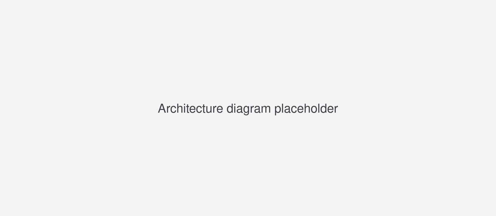
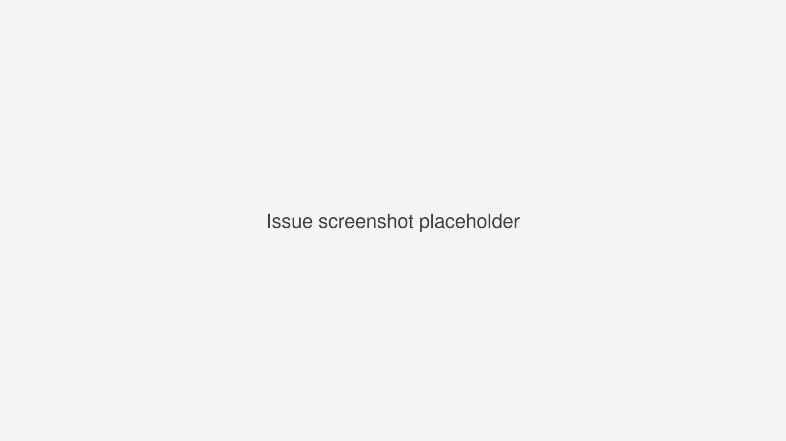

# Running a System One Model of Your Own on Amazon Bedrock

A lot of what we use language models for in production comes down to answering a question with one of a few fixed answers. Is this support ticket urgent or not? Does this transaction look like fraud? Is this error log a bug in our code, or a problem in something we depend on? The usual way to get that answer is to ask the model to write it. The model produces a paragraph and we parse the paragraph, or we ask for JSON and add a retry for when the JSON comes back broken, or we ask the model to rate its own confidence and get back a number it typed rather than one it measured.

In September, TypeSafe AI released [Jev](https://docs.typesafe.ai/models), which they describe as a System One model, after Daniel Kahneman's split between fast intuitive judgement and slow deliberate reasoning. Jev does not generate text at all. You send it some evidence and a question with named options, and it returns a probability for each option. There is nothing to parse, and no confidence to ask for, since the probability is the answer. TypeSafe's [homepage](https://typesafe.ai/) compares it with ordinary language models on three points: "decisions, not strings", with calibrated confidence on every one, 193.6 times faster, and 444.6 times cheaper.

I wanted to know how much of that you can get from an open model that you run yourself, on your own AWS account and in your own region, and what it costs you, so I measured it. To have something real to decide about, I also built a pipeline that reads every error log in an AWS account, decides whether each error comes from our own code and which repository it belongs to, and files a GitHub issue there with a root cause.

## What We Are Building

The workload is log triage. Every log group in an AWS account is captured. Every error is parsed and reduced to a fingerprint, so that one defect firing ten thousand times is counted ten thousand times and triaged once. Each new fingerprint gets a single typed decision: is this a defect in the service's own code, or a failure in something outside it, such as a dependency it calls or the platform it runs on? When the decision says ours with enough confidence, the pipeline fetches the source files the stack trace names, checks that the code could have thrown that exception where the trace says it did, has a larger model write a root cause paragraph, and opens an issue.



Most of the pipeline is ordinary serverless plumbing: a Kinesis stream fed by a CloudWatch account-level subscription, a Lambda function compiled ahead of time with .NET Native AOT so that it starts in under a hundred milliseconds, two DynamoDB tables, and a Step Functions state machine that takes one log event from arrival to either a filed issue or a stop with a reason. I will go through it, but briefly, because the part this post is about is the small box in the middle where a model turns a stack trace into a probability.

The model in that box is Qwen3-4B, a four billion parameter open model, imported into Amazon Bedrock with Custom Model Import. The technique for reading a decision out of it is borrowed from [SemIf](https://github.com/TheoLeeCJ/SemIf-OpenJev), an open reproduction of the Jev interface, which I ported to C#.

## How the Readout Works

A language model produces, at each step, a probability for every token in its vocabulary, and something then picks one of them. Generating text is that loop run many times. A typed decision runs it once and reads the probabilities instead of picking. The prompt lists the options as lettered choices and tells the model to answer with a single uppercase letter, we ask for exactly one token, and instead of reading which token it chose we read the probabilities it assigned to `A`, `B`, `C` and so on at that position. The API reports those as log probabilities, the natural logarithm of each probability, which is the form models work in internally: a probability of 1 is a log probability of 0, a probability of 0.01 is about minus 4.6, and the numbers only get more negative the less likely a token is. The model never writes a sentence, so there is nothing to parse, and the probability we get is the model's own distribution over the answers rather than a number it was asked to type.

On Bedrock that is one method in three steps. The request asks for one token and the twenty most likely candidates at that position, with the prompt rendered to a string ourselves (more on that below):

```csharp
writer.WriteStartObject();
writer.WriteNumber("max_tokens", 1);
writer.WriteNumber("temperature", 0);
writer.WriteString("prompt", Semif.RenderQwen3Prompt(messages));
writer.WriteNumber("logprobs", TopLogprobs);   // 20
writer.WriteEndObject();
```

The response has the shape of an OpenAI completion, with the candidates under `choices[0].logprobs.top_logprobs[0]`, one entry per token text. Each option is then matched to the letter it was presented as. A letter that did not make the top twenty is given negative infinity, since that is the log probability that converts back to a probability of exactly zero:

```csharp
var byToken = payload.GetProperty("choices")[0]
    .GetProperty("logprobs").GetProperty("top_logprobs")[0]
    .EnumerateObject()
    .ToDictionary(p => p.Name, p => p.Value.GetDouble(), StringComparer.Ordinal);

var optionLogprobs = new List<double>();
var index = 0;
foreach (var option in options.EnumerateArray())
{
    optionLogprobs.Add(byToken.TryGetValue(letters[index].ToString(), out var logprob)
        ? logprob
        : double.NegativeInfinity);
    index++;
}
```

Last, the log probabilities become probabilities that add up to one across the options. The tool for that is a softmax: convert each log probability back to a probability, then divide each by the sum of all of them, so that the option that had 0.90 and the option that had 0.05 come out as 0.947 and 0.053. Before that division, the code sums the probabilities as they were, which tells you how much of the model's probability landed on the declared letters at all. That is a number I will come back to. The softmax runs over the letters that were present, and absent letters stay at zero:

```csharp
var declaredMass = optionLogprobs.Where(double.IsFinite).Sum(Math.Exp);
return new ScoreResult(optionIds, SoftmaxAllowMissing(optionLogprobs), declaredMass);
```

`SoftmaxAllowMissing` is that softmax with two edge cases: no letters present gives all zeros, and one letter present gives that option probability one. That is the whole readout; the rest of the file is validation and error messages.

> [!NOTE]
> Bedrock exposes two request shapes for imported models, one modelled
> on OpenAI's Completions API and one on Chat Completions. The readout
> uses the first, since it takes a fully rendered prompt. Bedrock also
> reports `instructSupported: false` for the imported Qwen3 models, so
> it has not detected a chat template, and sending `messages` and
> trusting the server to render them is not safe.

## Two Things That Fail Quietly

It took most of a day to get sensible numbers out of the readout, because two things were wrong and neither of them produced an error.

The chat template was the first. Qwen3 is a reasoning model, and its packaged template ends the prompt at the start of the assistant's turn, which leaves the model free to open a `<think>` block. When it does, the first sampled token is the start of that block, and the distribution we read is over ways to begin thinking rather than over answer letters. The fix is to render the prompt ourselves and close an empty reasoning block inside it:

```csharp
public const string QwenThinkSuppressedSuffix = "<|im_start|>assistant\n<think>\n\n</think>\n\n";
```

With that suffix in place the answer letter is the first thing the model can produce. It is the same string Qwen's own tooling emits when thinking is disabled.

> [!NOTE]
> The prompt strings are kept byte-identical to SemIf's, so the SHA-256
> of a rendered prompt can be compared with that project's published
> results. That is also why the C# serialises the state the way Python's
> `json.dumps` does, down to the separators and number formatting.

The `logprobs` field was the other. On the request shape Bedrock uses for imported models it is an integer, the number of candidates to return. Sending `true`, which is what the chat-style API expects, is accepted without complaint and treated as one. You then get the single most likely token and nothing else, every option but the winner reads as missing, and the probabilities look plausible while meaning nothing. I found it by sending both forms and counting the candidates that came back: one against twenty.

Having been caught twice by answers that looked fine, I made the readout report the declared mass as well: the share of the model's probability that landed on the option letters at all, before normalising. When everything works it is 1.0000 at the median and 0.9996 at the minimum across the test set, so the model is putting essentially all of its probability on the letters we declared. When it drops, the model is answering some other question, and the normalised probabilities are a ratio of two small numbers presented as a decision. Jev does not expose this number. The readout does, and it is the first thing I look at when a result seems wrong.

## Getting a Model into Bedrock

Custom Model Import takes a folder of model weights from S3 and gives you back a model that you call through the normal Bedrock runtime API. It supports a fixed list of architectures, Qwen3 among them, and it runs in four regions, of which Frankfurt is the only one in Europe. There is no CloudFormation resource for it, so the import is a script run once from a GitHub Actions workflow: download the weights from Hugging Face one file at a time, upload each to S3, start the import job, and poll until it finishes. Qwen3-4B is eight gigabytes.

> [!NOTE]
> The supported list names the architecture, not the model family. For
> Qwen that means `Qwen3ForCausalLM` and `Qwen3MoeForCausalLM`. A Qwen3.5
> checkpoint reports a different architecture and the import job
> rejects it, which is how this project ended up on Qwen3.

The billing model is worth understanding before building on it. An imported model is charged per Custom Model Unit per minute while a copy of it is awake, in five-minute windows, and a copy goes to sleep after five minutes without a request. Qwen3-4B is one unit, which in Frankfurt costs $0.07144 a minute. The first request after a sleep does not wait for the copy to wake up. It fails, and keeps failing for thirty to sixty seconds, until the copy is ready. The pipeline's state machine retries the decision step with a backoff that spans about five minutes for this reason, and the first log after a quiet spell needed four attempts before it got an answer.

> [!NOTE]
> The failures during a wake-up are not all the same. The first ones are
> `ModelNotReadyException`, which the documentation tells you to retry.
> The last one before it came up was `ModelErrorException` with the
> message "the request failed in the model container", which reads like
> a bug in the request and is only the copy still loading. Retry both.

## Does It Decide Anything

To find out whether the 4B could triage, and not only answer, I wrote a small labelled set of error logs across .NET, Java, Python, Node and Go, in three bands.

Twenty rows are clear. `SocketTimeoutException` is a dependency, `NullReferenceException` is ours. A lookup table of exception types gets these right, so scoring well on them proves nothing, and they are only there to catch a model that gets them wrong.

Twelve rows are ambiguous, and they are the actual test. In each of them the exception type points one way and the cause points the other: a null reference caused by a dependency returning an empty body with a 200 status, a 400 from a dependency caused by our own arithmetic producing a negative quantity, a connection pool exhausted by our own missing dispose. Each row carries a field of evidence with the kind of signals a log pipeline already has, such as the response the dependency sent, connection counts, and recent deploys. The evidence states facts and never names a cause. A first version of these rows narrated the cause in a sentence at the end, and I threw that version away, since it was measuring reading comprehension.

With a single question, "is this a defect in this service's own code or a failure in something it calls", the results on the ambiguous band were:

| model | with evidence | without evidence |
|---|---:|---:|
| Qwen3-4B | 5 of 12 | 5 of 12 |
| Qwen3-32B | 6 of 12 | 3 of 12 |
| Jev | 8 of 12 | 4 of 12 |

The 4B gets the same five rows right with the evidence and without it, and on the rows it misses most confidently it reports a probability of exactly zero either way, which means it is not using the evidence at all. The 32B and Jev both drop sharply when the evidence is removed, so they are using it, but the 32B still ends up at six of twelve, and six of twelve is a coin toss. The 32B has eight times the parameters of the 4B and gets one more row right.

The 4B also cannot compare two numbers. Asked directly whether 2,841 connections acquired against 12 released is "far more often", it answers yes with probability one. Asked whether a 3,600 second refresh interval is longer than a 900 second token lifetime, it answers no with probability one. Rephrasing the question did not help. Since the pipeline is code, I moved the arithmetic into code. A small step walks the evidence, finds the relations worth naming, and states each of them as a sentence before the model sees the row, along the lines of "connections_opened is 237 times connections_disposed (2841 against 12)". The model is then asked what a stated comparison means, which it can do, instead of being asked to compute it.

The bigger change was to stop asking the causal question altogether. Instead of one question that requires a leap from trace to cause, the 4B is asked eight small questions it can read straight off the evidence, such as "does the evidence show a resource being acquired far more often than it is released" and "does the evidence show the platform changing or intervening on its own", and a few lines of code combine the answers into a probability. The model is only ever asked what the text says, and the code works out what that means.

On the twelve ambiguous rows this took the 4B from 5 of 12 to 10 of 12, ahead of Jev's 8 from the single question, and the combined probabilities were calibrated where the single question's had been stuck at zero and one. I had iterated the questions three times against those twelve rows to get there, though, and wrote that down as a caveat: some of that number had to be fitted.

So I wrote twelve more rows after the questions were frozen, and ran everything once on rows nothing had seen.

| | held-out, with evidence | held-out, without evidence |
|---|---:|---:|
| Qwen3-4B, single question | 9 of 12 | 9 of 12 |
| Qwen3-4B, eight questions | 8 of 12 | 9 of 12 |
| Jev, single question | 12 of 12 | 10 of 12 |
| Jev, eight questions | 12 of 12 | 10 of 12 |

Jev reads the evidence and gets every row from the single question, and the eight-question version adds nothing for it. The 4B with the eight questions scores below the trace alone, so with the evidence in front of it, it does worse than without. The gain on the tuned rows did not carry over.

In all four rows it got wrong, something in the evidence had changed and the 4B attributed the change to someone else. Our own deploy, two minutes before the errors started, reads as an external change. Our own retry policy, sending sixty times the usual traffic, with the sentence "3900 is 60 times 65" stated in front of the model, reads as the dependency failing. Our own timeout, lowered from ten seconds to two, reads as the platform intervening. The 4B registers that something changed but not who changed it, and Jev works that out from the same text.

It is a less flattering result than the one from the day before, and a more useful one, since it shows where the gap is. The readout mechanism works on an open model. Breaking the question down lets a small model match a purpose-trained one on cases it has been tuned against. On cases it has not seen, the purpose-trained model wins, and the gap is in how well the model reads the evidence, not in the mechanism.

## Why the Model Choice Matters

Qwen3 was chosen because it was on the import list, not because of any measured property. To see how much the choice mattered I imported Mistral-7B-Instruct and ran the same set through it.

Rendered through Mistral's own chat template, the model put no probability at all on the option letters. Declared mass was 0.0000. Its most likely first token was `**`, at probability 0.0009, because it was opening a bold heading to explain its answer, which is what it had been trained to do. Adding a trailing space to the prompt raised the mass to 0.155 and made a letter the most likely token. The best lead-in I found, ending the prompt with "The answer is", reached 0.24. Qwen3 reaches 1.0000 with no lead-in at all.

Mistral is not a worse model for this. With its best prompt it scored 22 of 32 on the same set against Qwen's 25, and it got every one of the clear dependency rows right. What the comparison shows is that "always produces a structured answer" is a property of how a model was instruction-tuned, not of the readout method, and that it does not show up in any benchmark. Without the declared mass number a model swap degrades quietly behind answers that still look confident: Mistral answered the first row correctly, at probability 1.0, while holding four hundred-thousandths of the distribution.

## The Pipeline in One Pass

The rest of the system is there to give the decision somewhere to go. I will keep to the shape of it here, since the architecture document in the repository has the detail.

An account-level subscription filter on CloudWatch Logs forwards every log event containing an error marker into a Kinesis stream. The filter excludes the pipeline's own two log groups by name, because a triage system that logs its triage and then triages its own logs is a billing incident waiting to happen. A Lambda function reads the stream in batches, parses each stack trace with a small regular expression per runtime, and reduces it to a fingerprint: the exception type plus the frames that belong to the application rather than to a library. A conditional counter in DynamoDB records the sighting, and only a fingerprint's first sighting starts a state machine execution, so from here on it is one execution per new defect.

> [!NOTE]
> The Python Lambda runtime logs an unhandled exception as one event
> with the lines joined by a bare carriage return, and it puts the
> exception line first, behind an `[ERROR]` prefix, where a native
> Python traceback has it last. The parser handles both shapes, and the
> demo function is what surfaced the difference.

The execution asks the model the eight questions concurrently when the event carries evidence, or the single question when it carries only a trace, combines the answers, and routes on the result. Below 0.3 the error is probably not ours and the execution ends. Between 0.3 and 0.7 it is held. Above 0.7 it escalates. A rate cap per repository and a global circuit breaker sit in front of escalation, because a bad deploy that breaks fifty services at once should page someone rather than open fifty issues at three in the morning.

Escalation fetches the files the stack frames name through the GitHub Contents API, five at most, and never clones anything. For each frame it asks the 4B one more typed question, "could this code throw this exception here", which catches a checkout that does not match the trace. It then sends the trace and the fetched files to Amazon Nova 2 Lite through the Converse API, the one generative call in the whole pipeline, and asks for a root cause in at most three sentences. The result is an issue:

> [!NOTE]
> Nova has to be called through its cross-region inference profile,
> `eu.amazon.nova-2-lite-v1:0`, not the bare model id. The bare id is
> not enabled for on-demand use in Frankfurt, and the profile keeps the
> request inside EU regions. The IAM grant then needs both the profile
> and the underlying foundation model in every region it can route to.



That issue was filed forty seconds after a Python function threw a `KeyError` on a tier name it did not know. The stack trace named `handler.py`, the pipeline fetched it, the 4B confirmed the code could throw there, and Nova quoted the offending line and described the missing validation. The whole path from log line to issue is a handful of typed decisions and one paragraph of generated text.

## Measuring Jev's Three Claims

TypeSafe's homepage makes three comparisons against ordinary language models: 193.6 times faster, "decisions, not strings", and 444.6 times cheaper. Those are Jev against a generating model, so the interesting question is how the 4B on Bedrock, which also does not generate, compares on the same three points, measured from a Lambda in Frankfurt.

**Fast.** A warm Qwen3-4B answers one question in 0.10 seconds at the median and 0.20 at the 95th percentile. Jev answers in 0.53 seconds, and that figure is the same whether the request carries one question or all eight, since Jev takes them in a single call. The 4B's eight questions run concurrently in the Lambda and cost one round trip. What Jev does not have is the cold start: after five idle minutes, the first request to the 4B fails for thirty to sixty seconds. If your logs arrive in bursts with quiet gaps between them, every burst pays it.

**Structured.** Both return a probability per option. Jev's come rounded to two decimals, with a separate confidence field. The readout's come from the logit distribution directly, and with them comes the declared mass, which is the number that told me Mistral was answering a different question. On calibration, measured as expected calibration error where lower is better, the 4B's single question scores 0.21, its eight questions score 0.08 on the tuned rows and 0.26 on the held-out rows, and Jev scores 0.14 on the tuned rows and 0.06 on the held-out rows.

> [!NOTE]
> The Jev comparison is not perfectly like for like. Jev received the
> option descriptions as its own named criteria and applied its own
> prompting, while the Bedrock path sends a frozen prompt. It is a fair
> reference point for the same rows, not the same prompt on two models.

**Cheap.** Jev charges $0.042 per million input tokens and nothing for output. An eight-question request measured about 1,450 tokens, so a full triage decision costs six thousandths of a cent, and a single question about a third of that. The 4B's cost depends on how long a copy is awake rather than on how many decisions it makes:

| how the copy is used | Qwen3-4B per month | per decision at 10,000 a month | Jev, same volume |
|---|---:|---:|---:|
| a trickle of logs that never lets it sleep | $3,090 | 31 cents | 60 cents in total |
| woken once an hour to drain a batch | $257 | 2.6 cents | 60 cents in total |
| loaded continuously | $3,090 | breaks even with Jev at about fifty million decisions a month, if one copy can serve nineteen a second, which I did not measure | |

Jev is cheaper per decision at every volume I can vouch for. The 4B gives you something else: the weights are yours, the prompt and the chat template are yours, the request never leaves eu-central-1, and there is no third party between your logs and your decision. If your logs cannot leave your region, or your compliance story needs the model to be something you own, the 4B is the option, and the table above is what it costs.

## Tradeoffs

There is no code fix for the cold start. Anything built on Custom Model Import at low volume either accepts a failed first request after every quiet spell, or keeps the copy awake and pays for it.

The 4B does not work out who changed something, as the held-out rows showed. Given evidence that says a change was ours, it registers the change and blames someone else. Moving the arithmetic and the identity comparisons into code helped on the rows I could tune against and did not generalise, while a purpose-trained model handles the same text without help. Breaking the question down is still worth doing, since it is what makes the probabilities calibrated enough to route on, but it does not close that gap.

The evidence is not being gathered yet. The ambiguous rows carry evidence I wrote by hand. A CloudWatch log event carries a message and a log group, so the deployed pipeline today sees a stack trace and nothing else, and on the held-out rows that trace-only path scores 9 of 12 for the 4B and 10 of 12 for Jev. Correlating a trace with metrics, deploys and dependency health at the moment it fired is the next piece of work, and it is not a small one.

The test set is small and synthetic: thirty-eight tuned rows and twelve held-out ones, written by the same person who wrote the questions. The numbers separate the approaches clearly enough, but I would not quote any of them to two decimal places as a property of the models.

## Companion Repository

The code is at [github.com/ganhammar/observe-ai](https://github.com/ganhammar/observe-ai). It deploys from GitHub Actions into an AWS account with nothing created by hand: one workflow imports the model, and one deploys the capture stack, the application stack, and the GitHub token from a repository secret. The `demo` folder holds a Python function with one deliberate bug and a script that writes its error into a log group, so the whole path can be exercised without deploying anything else. The `eval` folder holds the labelled rows, the runners for Bedrock and for Jev, and the raw outputs behind every number in this post, so you can check the arithmetic or run the same set against a model of your own.
