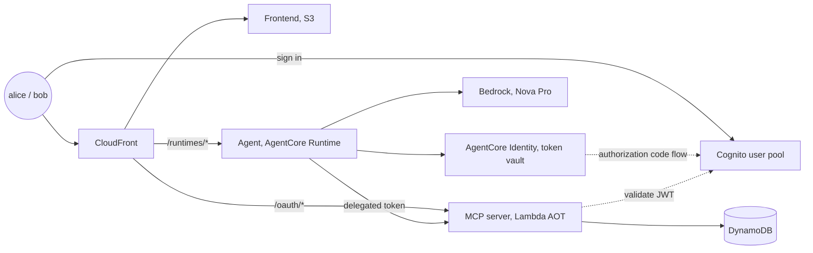
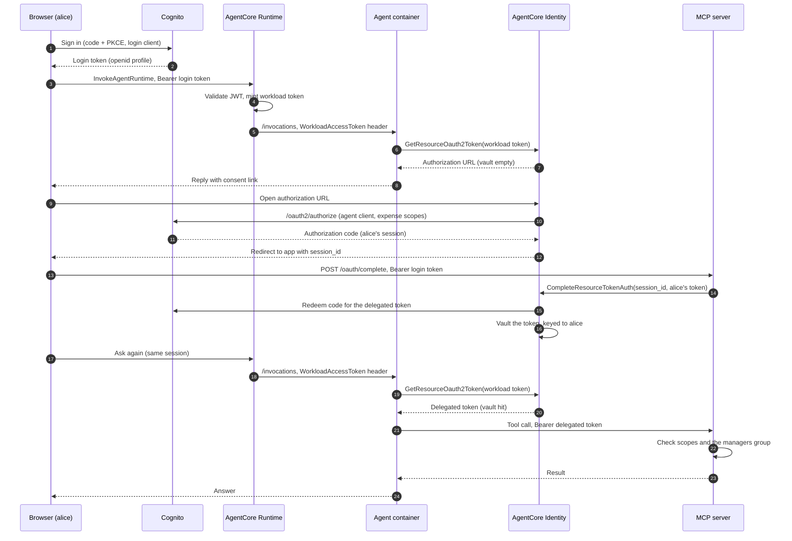

# Who Approved This? Delegated Authorization for AI Agents with AgentCore Identity

In 2019, a misconfigured firewall at Capital One was tricked into [lending out its AWS credentials](https://krebsonsecurity.com/2019/07/capital-one-data-theft-impacts-106m-people/). The interesting part is not the trick, it is what those credentials could do: read about a hundred million credit applications out of S3, something no firewall ever needs to do. Three years earlier, an AWS key committed to one of Uber's private repos [unlocked archives on 57 million riders and drivers](https://www.ftc.gov/news-events/news/press-releases/2018/04/uber-agrees-expanded-settlement-ftc-related-privacy-security-claims). That is an old pattern in application security. Software holding more power than any person it serves, with logs that record what the application did, not who asked for it. Before OAuth, integrations worked that way by default. Either the application ran in god mode on a privileged service account, or it asked users for their actual passwords, like RockYou, which collected webmail passwords for contact importing and [leaked 32 million credentials from plaintext storage](https://techcrunch.com/2009/12/14/rockyou-hack-security-myspace-facebook-passwords/) in 2009.

We spent the better part of two decades fixing that. Authorization code flows, scoped access tokens, refresh tokens, revocation. Later, token exchange ([RFC 8693](https://datatracker.ietf.org/doc/html/rfc8693)) gave middle services a standard way to trade a user's token for a narrower downstream token, what Microsoft calls the on-behalf-of flow. I have [explored this before](https://www.ganhammar.se/posts/delegation-tokens-with-amazon-cognito) in the context of Amazon Cognito, where a service constrains what a downstream actor may do with a user's identity.

Then AI agents arrived, and we regressed about twenty years. The typical agent integration today is an API key in an environment variable, which is god mode all over again. We already know how that story ends. In 2021, the [Codecov breach](https://about.codecov.io/security-update/) harvested exactly these keys out of thousands of CI environments and used them to reach downstream systems. The agent can do everything its key allows, for every user it serves, and when someone asks "who approved this expense?" the honest answer is "the agent did". That answer is useless. The user the agent acted for is gone from the trail, and revoking one user's access means rotating a key that everyone shares.

Agents need the on-behalf-of flow more than classic services ever did, because an agent is a far less predictable actor than a REST endpoint. This post builds that flow on AWS, with an agent on Amazon Bedrock AgentCore Runtime that acts on behalf of the signed-in user, holds only the permissions that user granted it, and leaves the user's name in the audit trail. In C#, end to end.

## What We Are Building

An expense assistant. Alice, an employee, chats with an agent that can list her expenses and submit new ones. Bob, her manager, uses the same agent to approve them. The same prompt gives different outcomes depending on who is signed in, and every action lands in the trail under the human's name. The business logic is deliberately boring, three tools and one DynamoDB table, because the authorization wiring around it is the point.

The frontend is plain HTML and JavaScript, served from S3 through CloudFront, where users sign in through the Cognito Hosted UI. The agent runs in a container on AgentCore Runtime, a Bedrock Converse loop. The MCP server runs on Lambda, compiled with Native AOT, owns the expense table, and enforces every permission. Cognito plays both the identity provider and the downstream authorization server, which keeps the demo self-contained. In a real system the downstream could be any OAuth2 provider. CloudFront also proxies the agent and session binding calls, so the browser talks to a single origin.

Everything except the frontend is C#, including the CDK stack. AgentCore has no high-level SDK for .NET, so the code calls the service APIs from the AWS SDK directly.



## The Delegation Model

Three tokens move through this system, and keeping them apart is most of what there is to understand about AgentCore Identity.

The first is the login token. Alice signs in to the frontend through the Cognito Hosted UI using the authorization code flow with PKCE, and her browser ends up with an access token issued to the frontend app client. That client is allowed the scopes `openid` and `profile`, nothing else. Her own token cannot call the expense API, and that is deliberate.

The second is the workload access token. When the browser invokes the agent, AgentCore Runtime validates her token against the user pool, using the discovery URL and allowed client id we configure on the runtime. It then exchanges the validated token for a workload access token and delivers it to the container in a request header named `WorkloadAccessToken`. This token represents the agent acting in a session that belongs to alice, and none of it is code we write.

> [!NOTE]
> The identity documentation names this exchange
> `GetWorkloadAccessTokenForJWT`. It exists as a public API, but with a
> JWT authorizer configured on the runtime, the runtime calls it for
> you and your code only ever sees the result.

The third is the delegated token, the one this post is named after. The agent hands its workload token to AgentCore Identity by calling `GetResourceOauth2Token`, asking for a token for the expense API with the expense scopes. AgentCore Identity acts as the OAuth client here. It holds the client secret for a second Cognito app client, runs the authorization code flow against the user pool, and stores the resulting token in the token vault, a managed store that comes with AgentCore Identity, keyed to alice. On later calls the vault answers directly.

The first time alice asks, the vault is empty and there is nothing to hand out. Instead, AgentCore Identity generates an authorization URL, and the agent relays it into the chat. Alice clicks it and consents. The consent by itself does not finish the flow. The redirect lands back on our application with a session identifier, and the application must call `CompleteResourceTokenAuth` before AgentCore Identity fetches and stores the token. That step gets its own section.



The two Cognito app clients are the load-bearing wall of this design. The login client proves who alice is. The agent client holds what the agent may be granted on her behalf, the expense scopes, behind a client secret that only AgentCore Identity ever sees. The agent's power comes entirely from the vaulted delegated token, which exists only because alice consented, is scoped to what the client allows, and dies with her grant.

> [!NOTE]
> The client secret on its own grants nothing. The agent client only
> allows the authorization code flow, so tokens exist only downstream
> of a signed-in user's consent, and never carry more than that user's
> grant.

One distinction does a lot of quiet work in the expense server. Scopes describe what a client may request on a user's behalf, and Cognito grants them per client, not per user. Whether alice may actually approve expenses is a property of alice, not of the client, and it lives in her `cognito:groups` claim. The approve tool therefore requires both the approve scope on the token and the managers group on the user behind it. Delegation controls how far the agent may reach, the group controls how far the human could reach in the first place.

> [!NOTE]
> Cognito only includes `cognito:groups` in access tokens granted with
> the `openid` scope. Request custom scopes alone and the claim is
> silently omitted.

## The Expense MCP Server

The server is where delegation gets enforced. It trusts the token in front of it, not the agent that sent it. The [official MCP C# SDK](https://github.com/modelcontextprotocol/csharp-sdk) plugs into standard ASP.NET Core authentication, so the wiring is ordinary JwtBearer against the user pool, plus the MCP challenge scheme:

```csharp
var issuer = $"https://cognito-idp.{region}.amazonaws.com/{userPoolId}";

builder.Services
    .AddAuthentication(options =>
    {
        options.DefaultAuthenticateScheme = JwtBearerDefaults.AuthenticationScheme;
        options.DefaultChallengeScheme = McpAuthenticationDefaults.AuthenticationScheme;
    })
    .AddJwtBearer(options =>
    {
        options.Authority = issuer;
        options.TokenValidationParameters = new TokenValidationParameters
        {
            ValidIssuer = issuer,
            // Cognito access tokens carry the app client in client_id, not aud
            ValidateAudience = false,
            NameClaimType = "username",
        };
    })
    .AddMcp(options =>
    {
        // Served at /.well-known/oauth-protected-resource (RFC 9728). The
        // resource identity derives from the request, so the server does
        // not need to know its own public URL
        options.Events.OnResourceMetadataRequest = context =>
        {
            context.ResourceMetadata = new()
            {
                Resource = $"{context.Request.Scheme}://{context.Request.Host}",
                AuthorizationServers = { issuer },
                ScopesSupported = ["expenses/read", "expenses/write", "expenses/approve"],
            };
            return Task.CompletedTask;
        };
    });
```

Unauthenticated requests get a 401 with a `WWW-Authenticate` header pointing at the metadata endpoint, which is how spec-compliant MCP clients discover the authorization server.

> [!NOTE]
> Lambda function URLs rename the header to
> `x-amzn-remapped-www-authenticate`. Nothing in this system reads the
> challenge, since the agent gets its tokens from AgentCore Identity,
> but an external MCP client pointed straight at the server will trip
> on it.

Inside the tools, the scope and group distinction from earlier becomes two small guards, and approving requires both:

```csharp
[McpServerTool(Name = "approve_expense")]
[Description("Approve a pending expense. Managers only.")]
public async Task<Expense> ApproveExpense([Description("The expense id")] string id)
{
    RequireScope("expenses/approve");
    RequireGroup("managers");
    // ... load, update, return
}

void RequireScope(string scope)
{
    var granted = User.FindFirstValue("scope")?.Split(' ') ?? [];
    if (!granted.Contains(scope))
        throw new McpException($"Token is missing required scope '{scope}'.");
}

void RequireGroup(string group)
{
    if (!User.HasClaim("cognito:groups", group))
        throw new McpException($"'{User.Identity!.Name}' is not in group '{group}'.");
}
```

A thrown `McpException` reaches the model as a tool error, which is what lets the agent relay a refusal in plain language instead of hallucinating around it. The server runs as a Native AOT binary on `provided.al2023` behind a function URL.

## The Agent

AgentCore Runtime asks very little of a container. Answer `GET /ping` with a health status and `POST /invocations` with whatever your agent does. Ours is an ASP.NET Core minimal API around a Bedrock Converse loop, with the MCP server's tool list mapped to Converse tool specs. There is no agent framework in it, since a framework would only bury the identity code.

That identity code is short. The invocation handler picks up the workload token the runtime delivered and asks the broker for alice's delegated token:

```csharp
app.MapPost("/invocations", async (
    InvocationRequest payload, HttpRequest request, TokenBroker broker, AgentLoop agent) =>
{
    var workloadToken = request.Headers["WorkloadAccessToken"].ToString();

    var (userToken, authorizationUrl) = await broker.GetUserToken(workloadToken);
    var answer = authorizationUrl is not null
        ? await agent.RunWithoutAccess(payload.Prompt, authorizationUrl)
        : await agent.Run(payload.Prompt, userToken!);
    return Results.Ok(new InvocationResponse(answer));
});
```

The broker asks AgentCore Identity for the user's token. Either the vault holds a grant and returns it, or the response carries an authorization URL for the consent flow. One wrinkle is handled inline, since the vault does not do it for us: if the stored grant no longer covers the scopes we request, the broker forces a fresh consent.

```csharp
public class TokenBroker
{
    static readonly string Provider =
        Environment.GetEnvironmentVariable("CREDENTIAL_PROVIDER") ?? "cognito-expenses";
    // openid is required for Cognito to include identity claims, such as
    // cognito:groups, in the access token
    static readonly List<string> Scopes =
        ["openid", "expenses/read", "expenses/write", "expenses/approve"];
    // Where the user's browser lands after granting consent (session binding)
    static readonly string ReturnUrl =
        Environment.GetEnvironmentVariable("APP_URL") ?? "http://localhost:4000/";

    readonly AmazonBedrockAgentCoreClient _client = new();

    public async Task<(string? UserToken, string? AuthorizationUrl)> GetUserToken(
        string workloadToken)
    {
        var response = await Request(workloadToken, force: false);

        // The vault returns the stored grant even if the requested scopes
        // have widened since the user consented; a fresh consent is needed
        if (response.AccessToken is { } token && !CoversScopes(token))
            response = await Request(workloadToken, force: true);

        return (response.AccessToken, response.AuthorizationUrl);
    }

    Task<GetResourceOauth2TokenResponse> Request(string workloadToken, bool force) =>
        _client.GetResourceOauth2TokenAsync(new GetResourceOauth2TokenRequest
        {
            WorkloadIdentityToken = workloadToken,
            ResourceCredentialProviderName = Provider,
            Scopes = Scopes,
            Oauth2Flow = Oauth2FlowType.USER_FEDERATION,
            ResourceOauth2ReturnUrl = ReturnUrl,
            ForceAuthentication = force,
        });

    static bool CoversScopes(string token)
    {
        var payload = token.Split('.')[1].Replace('-', '+').Replace('_', '/');
        using var claims = JsonDocument.Parse(
            Convert.FromBase64String(payload.PadRight((payload.Length + 3) / 4 * 4, '=')));
        var granted = claims.RootElement.TryGetProperty("scope", out var scope)
            ? scope.GetString()!.Split(' ')
            : [];
        return Scopes.All(granted.Contains);
    }
}
```

> [!NOTE]
> This matters after launch too. Widening the agent's scopes does not
> invalidate existing grants, so every returning user keeps the narrow
> token until something forces a new consent.

> [!NOTE]
> `USER_FEDERATION` is the three-legged flow, where a user grants the
> agent access to something the user owns. The same API also runs a
> two-legged client credentials flow, for the narrower cases where the
> agent legitimately acts as itself rather than for a user.

With a token in hand, the agent connects to the MCP server as alice. The delegated token rides the connection, so every tool call downstream executes as the caller, never as the agent:

```csharp
await using var mcp = await McpClient.CreateAsync(new HttpClientTransport(new()
{
    Endpoint = new Uri(McpUrl),
    TransportMode = HttpTransportMode.StreamableHttp,
    AdditionalHeaders = new Dictionary<string, string>
    {
        ["Authorization"] = $"Bearer {userToken}",
    },
}));
```

Returning the authorization URL for every message would mean a user who says "hi" gets an authorization ceremony. Instead, `RunWithoutAccess` runs the model with no tools and puts the link in the system prompt, with instructions to surface it only when the request actually needs expense access. The model decides relevance.

> [!NOTE]
> Nova models interleave `<thinking>` blocks into their text output.
> The agent strips those before returning a reply, since they are
> reasoning scaffolding rather than an answer.

## Closing the Loop: Session Binding

Consent alone stores nothing, and the getting started material does not mention it. After alice approves the grant, AgentCore Identity redirects her browser back to your application with a `session_id` in the query string, and your application must call `CompleteResourceTokenAuth`, presenting the signed-in user's own token. Only then does AgentCore Identity redeem the authorization code and put the delegated token in the vault. Skip this and the flow fails quietly. Consent appears to succeed, the user lands back in your app, and the agent hands out a fresh consent link on every message, forever.

> [!NOTE]
> Authorization URLs are short lived. Each one and its session URI are
> valid for ten minutes. A consent link sitting in an old chat tab has
> expired long before it can leak anywhere interesting, but it also
> means the user needs a fresh ask if they walk away mid grant.

The step exists for a good reason. An authorization URL is just a link, and links get forwarded. Session binding is your application attesting that the person who consented is the person with an active session right now, so a grant cannot be planted by handing someone else's consent link to a logged-in victim. The [session binding documentation](https://docs.aws.amazon.com/bedrock-agentcore/latest/devguide/oauth2-authorization-url-session-binding.html) covers the design, and notes that `agentcore dev` hosts this callback and calls the API for you in local development, so the flow works end to end without your application doing anything, right up until you deploy to the real runtime.

In this system the completion endpoint lives on the MCP server, which already authenticates exactly these users. `RequireAuthorization` means only someone holding a valid login token can complete a grant, and that token doubles as the attestation:

```csharp
app.MapPost("/oauth/complete", async (
    CompleteAuthRequest body, HttpContext context, IAmazonBedrockAgentCore identity) =>
{
    var userToken = context.Request.Headers.Authorization
        .ToString()["Bearer ".Length..];
    await identity.CompleteResourceTokenAuthAsync(new CompleteResourceTokenAuthRequest
    {
        SessionUri = body.SessionId,
        UserIdentifier = new UserIdentifier { UserToken = userToken },
    });
    return Results.Ok();
}).RequireAuthorization();
```

The frontend's part is small. When the page loads with a `session_id` in the query string, POST it to the endpoint with the user's token, then let the conversation continue. Two details matter. The return URL must be allowlisted on the runtime's workload identity, or the token request fails outright, and the browser must keep the same runtime session id across the redirect, because the pending grant belongs to the session that requested it. For extra hardening, an opaque `customState` carried through the round trip protects the callback against cross-site request forgery. We lean on the endpoint requiring the user's own valid token and leave the state parameter as an exercise.

## Deploying It

The [AgentCore constructs](https://docs.aws.amazon.com/cdk/api/v2/docs/aws-cdk-lib.aws_bedrockagentcore-readme.html) recently graduated into stable `aws-cdk-lib`, and the identity pieces are small. Inbound auth on the runtime is one line, and the credential provider is a real CloudFormation resource that takes the agent client's credentials and the user pool's endpoints:

```csharp
var runtime = new AgentRuntime(this, "AgentRuntime", new RuntimeProps
{
    RuntimeName = "who_approved_this",
    AgentRuntimeArtifact = AgentRuntimeArtifact.FromEcrRepository(agentRepo, agentTag),
    NetworkConfiguration = RuntimeNetworkConfiguration.UsingPublicNetwork(),
    AuthorizerConfiguration = RuntimeAuthorizerConfiguration.UsingCognito(
        pool, [frontendClient]),
    ExecutionRole = agentRole,
});

var credentialProvider = OAuth2CredentialProvider.UsingCognito(this, "CognitoProvider",
    new IncludedOauth2TenantCredentialProviderProps
    {
        OAuth2CredentialProviderName = "cognito-expenses",
        ClientId = agentClient.UserPoolClientId,
        ClientSecret = agentClient.UserPoolClientSecret,
        Issuer = issuer,
        AuthorizationEndpoint = $"{domain.BaseUrl()}/oauth2/authorize",
        TokenEndpoint = $"{domain.BaseUrl()}/oauth2/token",
    });
```

One dependency cannot be expressed in CloudFormation. The agent client must list the credential provider's callback URL, but the provider needs that client's secret to exist first. A post-deploy step breaks the cycle, and while it is there it also registers the session binding return URL on the workload identity:

```bash
aws cognito-idp update-user-pool-client --client-id "$AGENT_CLIENT_ID" \
  --callback-urls "$PROVIDER_CALLBACK" # restate the full OAuth config here

aws bedrock-agentcore-control update-workload-identity \
  --name "$WORKLOAD_IDENTITY" \
  --allowed-resource-oauth2-return-urls "$SITE_URL"
```

A few things the error messages will not lead you to gracefully:

- AgentCore Identity stores the provider's client secret in Secrets Manager and reads it with the caller's permissions. Both the runtime execution role and whatever role calls `CompleteResourceTokenAuth` need `secretsmanager:GetSecretValue` on `bedrock-agentcore-identity!default/oauth2/<provider>-*`.
- `UpdateWorkloadIdentity` authorizes against the workload identity directory ARN as well as the identity itself, so a least privilege policy needs both.
- The runtime requires the image to be a single OCI manifest. Classic `docker build` pushes a Docker v2 manifest that passes ECR, CloudFormation, and the control plane, then fails at session start with a 424 and empty logs. Build with `docker buildx --provenance=false --sbom=false`.
- Set a `WORKDIR` in the image. With content root `/`, the ASP.NET configuration file watcher walks the entire filesystem of the microVM and the container never comes up, with the same silent 424.

The binaries are built as Native AOT on GitHub's arm64 runners, with no containers in the Lambda path and the link step pinned to the glibc that `provided.al2023` ships. The workflow in the [companion repository](https://github.com/ganhammar/who-approved-this) is the reference.

## The Payoff

Alice asks the agent to submit a coffee expense. The first time, she gets the consent link, grants access, and the expense appears. Then she tries her luck:

> **alice:** Approve "Coffee" expense
>
> **agent:** I'm sorry, but I cannot approve the "Coffee" expense because I don't have the required manager permissions. Please ask a manager to approve this expense.

The agent did not decide this. The approve tool rejected the call because alice is not in the managers group, and the agent relayed the refusal. Bob asks the same thing and it goes through:

> **bob:** Approve "Coffee"
>
> **agent:** Expense "Coffee" has been approved.

The expense item in DynamoDB now reads `approvedBy: bob`. Not `approvedBy: agent`, not a service account, a person. Put bob's two tokens side by side. His login token carries `openid profile` for the frontend client. The token the MCP server saw carries the expense scopes and his group for the agent client, with the same `sub`. Same human, different power, and the difference is exactly what he consented to.

```json
// bob's login token
{
  "sub": "a07cb95c-c0f1-704f-3d74-e5c44138c032",
  "client_id": "1gb4d621up8enhjc1gbjje3am2",
  "scope": "openid profile",
  "username": "bob",
  "token_use": "access"
}
```

```json
// the delegated token the MCP server saw
{
  "sub": "a07cb95c-c0f1-704f-3d74-e5c44138c032",
  "cognito:groups": ["managers"],
  "client_id": "5mjj06ii7fj5n8mp5h41o9064c",
  "scope": "expenses/approve openid expenses/read expenses/write",
  "username": "bob",
  "token_use": "access"
}
```

## Tradeoffs

The consent round trip is real friction. A redirect, a completion endpoint, an allowlisted return URL, and infrastructure to support all three. For a single-tenant internal tool where one person owns everything, an API key is less work and delegation buys you little. It starts paying for itself the moment a second user shows up: per-user permissions, per-user revocation, and an audit trail with names in it.

Some rough edges worth knowing about:

- Cognito auto-grants scopes for its own app clients, so this demo has no real consent screen, just a redirect bounce. A third party provider like Google or GitHub would show one.
- First use per user costs a full authorization round trip. Vault hits after that are cheap.
- This design runs the MCP handshake on every invocation. Production code would cache the connection.
- Invocations answer 424 while an endpoint rolls to a new version, so deploys cause a brief gap.
- The developer experience is Python first. The decorators and `agentcore dev` conveniences stop there, so C# gets the raw APIs. For this post that was fine, but the gap is real.

On cost, the reflection from the [centaur chess post](https://www.ganhammar.se/posts/building-a-centaur-chess-app-with-agentcore-runtime-and-strands-agents) applies here too. Each runtime session is a dedicated microVM that lives until its idle timeout, so a conversation with pauses pays for idle time. The identity layer itself adds almost nothing. The credential provider stores one client secret in Secrets Manager at standard pricing, per provider rather than per user, and the delegated tokens live in the vault with no billing surface of their own. Lambda and DynamoDB round to zero at this scale.

## Companion Repository

The full example is in the [GitHub repository](https://github.com/ganhammar/who-approved-this): agent, MCP server, CDK stack, frontend, and the deploy pipeline. To run it yourself, fork it, point the workflow at an OIDC deploy role, set a demo password secret, and push. The README covers the details.

The pattern generalizes past expenses. Anywhere an agent acts for signed-in users, against any API that speaks OAuth2, the same three tokens and the same binding step apply.
